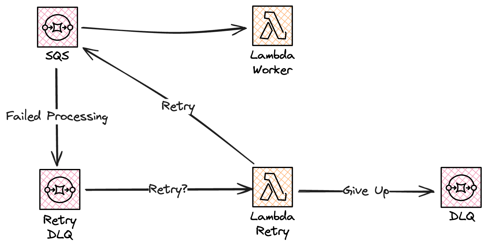

# Architecture Pattern - Retry with Jitter

## Intro

In the scenarios where our processing do fail we need to retry again.

But, retries are selfish and what we don't want to do, in case it's a downstream services that fail, or if we are throttled by the database, is to just retry again. Instead we like to backoff and give the service som breathing room. We would also like to apply exponential backoff, so if our second call also fails we like to back off a bit more. So first retry we do after 1 second, then 2, then 4, and so on till we either timeout and give up of have a success.

There is a study conducted by AWS, a couple of years ago, that show that in a highly distributed system retries will eventually align. If all retries happen with the same backoff, 1 second, 2 seconds, 4 seconds and so on they will eventually line up and happen at the same time. This can then lead to the downstream service crashing directly after becoming healthy just due to the amount of job that has stacked up and now happen at the same time. It's like in an electric grid, after a power failure, all appliances turn on at the same time creating such a load on the grid that it go out again, or we blow a fuse. We change the fuse, everything turn on at the same time, and the fuse blow again.

Therefor we should also use some form of jitter in our backoff algorithm. This could be that we add a random wait time to the backoff time. It would work that we first wait 1 second + a random number of hundreds of milliseconds. Second time we wait 2 second + 2x a random number, and so on. By doing that, our services will not line up the retries. How we add the jitter and how much, that well depends on your system and implementation.

## Benefits

There are many benefits, including:

* The exponential backoff algorithm increases the waiting time between retries exponentially, which helps prevent the system from being overwhelmed by repeated, frequent retry attempts in the face of failures.
* By adding jitter (randomness) to the delay times, the retries from different clients or processes are more spread out over time. This randomness helps to avoid situations where many clients retry simultaneously.

## Considerations

* Determining the optimal delay, exponential factor, and maximum delay requires careful consideration. These parameters can vary significantly depending on the specific use case and characteristics of the system.
* Implementing exponential backoff with jitter will introduce additional complexity in the system. There is a need to ensure that the retry logic does not introduce performance issues.
* It’s crucial to distinguish between different types of errors. Those that are likely to be resolved with retries (e.g., network timeouts) and those that are not (e.g., authentication errors). Retrying a error that is guaranteed to fail is a waste of resources.

## Examples

In the [examples](examples/) folder templates for different setup is present.

Below is an overview of an example using SQS and a Lambda worker.

