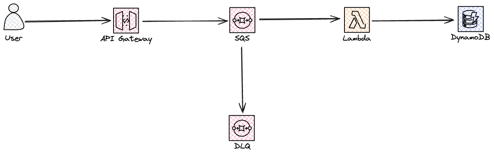

# Architecture Pattern - Storage-First

## Intro

Storage-First is a powerful architecture pattern when building resilient serverless solutions on AWS Cloud. The idea behind this pattern is to always store incoming data in a durable storage before processing. Preferably only using other serverless and managed services from AWS to do so.

By storing the data we have an exact copy in case of our processing fails. Examples of failures could be.

* Processing failures
* Database persisting errors
* Failure when calling a downstream 3rd party service or API.

It is very important to note this is asynchronous pattern, data will be processed later.

### Benefits

There are many benefits when using storage-first, including:

* This pattern offers a advantage for critical systems by ensuring requests are immediately stored, a good approach is to combine with Dead Letter Queues (DLQs).
* This pattern creates a highly scalable solution, as data processing can be scaled at your own pace in periods of high load. Creates a good combination with load-leveling pattern.
* This pattern increases resiliency as it uses direct integration without the need for an intermediary compute, like Lambda functions.
* This pattern reduce the risk of loosing an request from users or integrations.

### When not to use this pattern

There are scenarios when storage-first is not the pattern to be used.

* This pattern should not be used when asynchronous processing is not possible, when the caller expect a direct response.

### Potential problems

* This pattern require that it's possible to re-processes failed requests without user input. The use of DLQs and re-drive policies is crucial.
* This pattern introduce additional latency as processing is done in an asynchronous way.
* Data is eventual consistent due to the asynchronous processing.

## Examples

In the [examples](examples/) folder templates for different setup is present. Below is an overview of an classical API pattern.

