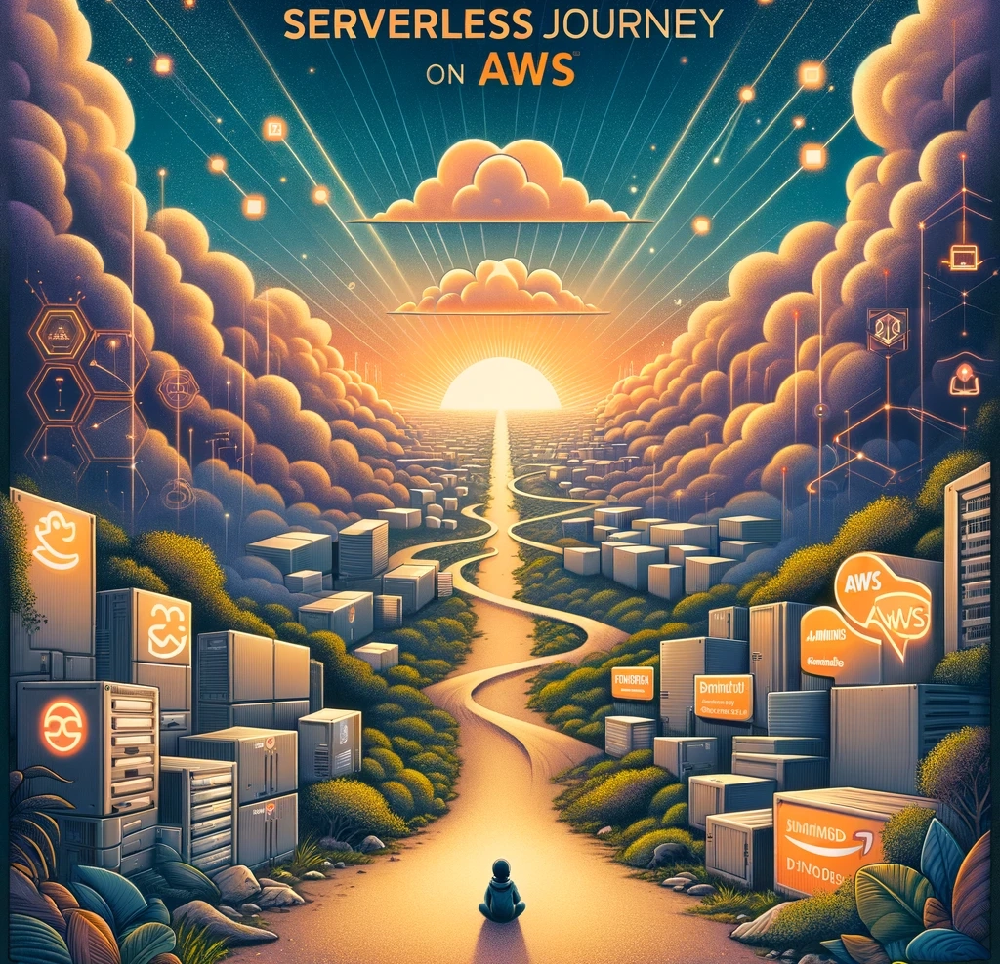

# My Serverless Handbook

**Welcome to My Serverless Handbook.**

I'm Jimmy Dahlqvist, cloud architect and developer with deep-rooted passion for serverless and event-driven design.

This is the home to my learnings and experiences working with serverless and event-driven workloads on AWS. I started working with serverless technologies back in 2015. You who have heard my public talks might remember me saying that when I started AWS Lambda had a maximum memory of 1024mb and there was no environment variables, that is how Lambda-old I am.

As an [AWS Serverless Hero](https://aws.amazon.com/developer/community/heroes/jimmy-dahlqvist), AWS Ambassador, and User Group Leader, I've dedicated myself to sharing knowledge and contributing to the broader AWS community.

I hope you will enjoy this corner in the serverless and event-driven universe!!

## Connect with me

## What to expect

In this repo you will find my learnings and experiences across a couple of different categories, that you can use to learn serverless and event-driven on AWS. When I say serverless it will not only be about Lambda functions, StepFunctions and EventBridge. It will also be SQS, SNS, IoT Core, ECS with Fargate, S3, CloudFront and many many more services.

For the most parts new solutions will be accompanied by a deep dive blog post on [jimmydqv.com](https://jimmydqv.com)

### Solutions

Solutions are ready to deploy PoC, tests, and solutions of different sizes. Everything from large complex solutions to small bite sized. These solutions can be deployed, tested, and adapted for your needs.

### Tutorials

Tutorials are step by step instructions, with all source code available, that you can follow and learn how to build a particular solution. This can range from running a Java service on Fargate to build a multi-region IoT solution. Tutorials will always have all source code, including all CloudFormation, available for easy deploy.

### Workshops

Workshops are like Tutorials but without detailed step by step instructions. Instead it can be an instruction saying "Create a StepFunction and have it invoked by an event coming from S3 on the default event-bus." Workshops will have hints, if you need assistance, and detailed step by step instructions in case you get stuck. Just as with Tutorials all source code, including all CloudFormation, will be available if you need it.

### Architecture Patterns

Architecture Patterns are common patterns that I use over and over again, with description of it's benefits and why I use it. It will also contain instructions and source code on how to implement the pattern in a serverless way.

### Lesson learned

Lesson learned is a section with some gotchas and learnings from working with serverless on AWS for many many years.
