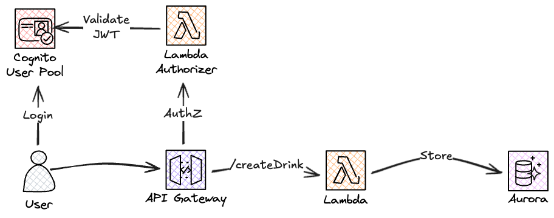
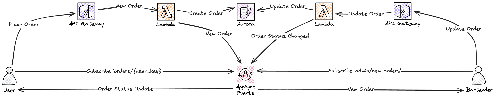
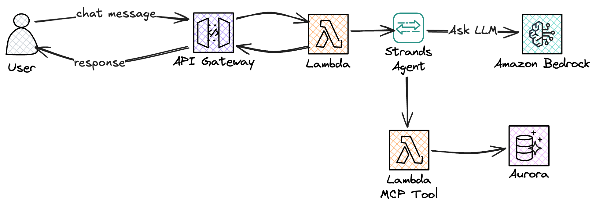

# AI Bartender

A serverless AI-powered bartender for house parties. Guests browse the drink menu, place orders with real-time status updates, and chat with an AI bartender that recommends drinks from the actual menu. Built entirely on AWS with Infrastructure as Code.


<p align="center">
  
</p>

> [!NOTE]
> **Built with AI Assistance**
>
> | Area | Role |
> |---|---|
> | Architecture, infrastructure & business logic | Designed & created solely by a human |
> | Backend (Python, Lambda, SAM) | Co-developed with AI assistance |
> | Frontend (React, TypeScript, Tailwind) | Developed by AI |  

## Architecture

The REST API handles menu browsing and order management. Admin requests are authorized via Cognito JWTs, while guest endpoints use self-signed JWTs issued during invite-code registration.

<p align="center">
  
</p>

Real-time order updates flow through AppSync Events, giving guests instant notifications when their drink is ready.

<p align="center">
  
</p>

The AI bartender uses Strands Agents with Amazon Bedrock Nova 2 Lite for conversational drink recommendations. MCP (Model Context Protocol) tools ensure the agent only recommends drinks that are actually on the menu.

<p align="center">
  
</p>

### Key Components

| Component | Technology |
|---|---|
| AI Agent | [Strands Agents](https://github.com/strands-agents/strands) + Amazon Bedrock Nova 2 Lite |
| Database | Amazon Aurora DSQL (serverless PostgreSQL) |
| REST API | API Gateway + Lambda (28 functions) |
| Streaming Chat | [Lambda Web Adapter](https://github.com/awslabs/aws-lambda-web-adapter) + FastAPI (SSE) |
| Real-time Updates | AppSync Events (WebSocket pub/sub) |
| Auth (Admin) | Amazon Cognito (Hosted UI, OAuth 2.0) |
| Auth (Guests) | Invite codes + self-signed JWTs |
| MCP Tools | AgentCore Gateway + dedicated tool Lambda |
| Conversation Memory | AgentCore Memory (short-term + preference extraction) |
| Images | S3 + CloudFront CDN + auto-resize/WebP pipeline |
| IaC | AWS SAM / CloudFormation (11 stacks, zero console clicks) |

## Features

- **Drink Menu** — Browse drinks by category with optimized images
- **Order System** — Place orders with real-time status tracking (pending → preparing → ready)
- **AI Chat** — Streaming responses with conversation memory and menu-aware recommendations
- **Guest Registration** — Invite codes shared via QR/link, no account needed
- **Admin Dashboard** — Menu CRUD, order management, registration code generation
- **Image Pipeline** — Upload originals, auto-resize to 4 sizes, convert to WebP
- **Event-Driven** — EventBridge decouples API from async workflows (image generation, notifications)

## Project Structure

```
ai-bartender/
├── aws/
│   ├── infrastructure/             # Foundational resources (6 stacks)
│   │   ├── datastore/              # Aurora DSQL cluster + IAM roles
│   │   ├── auth/                   # Cognito User Pool + clients
│   │   ├── hosting/                # S3 + CloudFront CDN
│   │   ├── hosting-ssl/            # CloudFront SSL cert (us-east-1)
│   │   ├── eventbridge/            # Custom event bus
│   │   └── appsync/                # AppSync Events (real-time)
│   └── services/                   # Application services (5 stacks)
│       ├── api/                    # REST API (drinks, orders, admin, auth)
│       ├── chat-api/               # Streaming chat (FastAPI + SSE)
│       ├── agentcore/              # AgentCore Gateway + Memory + MCP Tools
│       ├── image-generation/       # Bedrock image prompt generation
│       └── image-processing/       # Image resize + WebP pipeline
├── database/                       # Schema migrations, seed data, query tools
├── frontend/                       # React + TypeScript + Tailwind CSS
└── docs/images/                    # Architecture diagrams
```

## Prerequisites

- AWS account with [Bedrock model access](https://docs.aws.amazon.com/bedrock/latest/userguide/model-access.html) enabled for **Amazon Nova 2 Lite**
- [AWS SAM CLI](https://docs.aws.amazon.com/serverless-application-model/latest/developerguide/install-sam-cli.html) v1.100.0+
- Python 3.13+
- Node.js 20+
- AWS CLI configured with appropriate credentials

## Deployment

Stacks must be deployed in order due to cross-stack references. See [aws/README.md](aws/README.md) for full deployment guide.

### Quick Start

```bash
# 1. Infrastructure (deploy in order)
cd aws/infrastructure/hosting-ssl && sam build && sam deploy    # SSL cert (us-east-1)
cd ../datastore && sam build && sam deploy                      # Aurora DSQL
cd ../auth && sam build && sam deploy                           # Cognito
cd ../eventbridge && sam build && sam deploy                    # Event bus
cd ../appsync && sam build && sam deploy                        # Real-time events
cd ../hosting && sam build && sam deploy                        # S3 + CloudFront

# 2. Database schema
cd ../../../database/schema-manager
pip install -r requirements.txt
python schema_manager.py --action upgrade --profile <your-profile>

# 3. Services (deploy in order)
cd ../../aws/services/api && sam build && sam deploy             # REST API
cd ../agentcore && sam build && sam deploy                       # MCP + Memory
cd ../chat-api && sam build && sam deploy                        # Streaming chat
cd ../image-generation && sam build && sam deploy                # Image prompts
cd ../image-processing && sam build && sam deploy                # Image pipeline

# 4. Seed the menu
cd ../../../database/seed-data
pip install -r requirements.txt
python seed_data.py --profile <your-profile>

# 5. Frontend
cd ../../frontend
npm install && npm run build
aws s3 sync dist/ s3://<frontend-bucket-name> --delete
```

### Configuration

Each stack uses `samconfig.yaml` for deployment parameters. Cross-stack references use CloudFormation exports.

| Stack | Key Parameters |
|---|---|
| `api` | `DatastoreStackName`, `AuthStackName`, `EventBridgeStackName`, `AppSyncStackName` |
| `agentcore` | `DatastoreStackName` |
| `chat-api` | `AgentCoreStackName` |
| `image-processing` | `HostingStackName`, `DatastoreStackName` |

## Blog Series

This project is documented in a 3-part blog series:

1. **[Part 1: Foundation](https://jimmydqv.com/serverless-ai-bartender-part-1/)** — Aurora DSQL, REST API, Cognito auth, EventBridge, image pipeline
2. **[Part 2: Ordering & Real-time](https://jimmydqv.com/serverless-ai-bartender-part-2/)** — Guest registration, self-signed JWTs, AppSync Events pub/sub
3. **[Part 3: AI Agent](https://jimmydqv.com/serverless-ai-bartender-part-3/)** — Strands Agents, MCP tools, AgentCore Memory, Lambda streaming

## Cost

All services are serverless and pay-per-use:

| Service | Estimated Cost (Low Traffic) |
|---|---|
| Aurora DSQL | ~$0.50-2.00/day |
| Lambda | ~$0.10-1.00/day |
| API Gateway | ~$0.01-0.50/day |
| Bedrock (Nova 2 Lite) | ~$0.001/1K input tokens |
| AgentCore Memory | Included with Bedrock |
| S3 + CloudFront | ~$0.01-0.50/day |

A house party with 20 guests chatting all evening costs under $1 in Bedrock usage.

## Security

- **IAM Roles** — Least privilege with separate reader/writer roles for DSQL
- **DSQL Authentication** — IAM-based, no passwords stored
- **API Gateway** — CORS configured, rate limiting, API keys required
- **Cognito** — JWT validation for admin endpoints
- **Guest Auth** — Self-signed JWTs with RSA keys in Secrets Manager
- **AgentCore Gateway** — IAM authentication
- **S3** — No public access, CloudFront Origin Access Control

## License

This project is licensed under the MIT License - see the [LICENSE](LICENSE) file for details.

## Acknowledgments

- [Strands Agents](https://github.com/strands-agents/strands) — Python AI agent framework
- [AWS Lambda Web Adapter](https://github.com/awslabs/aws-lambda-web-adapter) — Streaming support for Python Lambda
- [AWS SAM](https://aws.amazon.com/serverless/sam/) — Serverless Application Model
