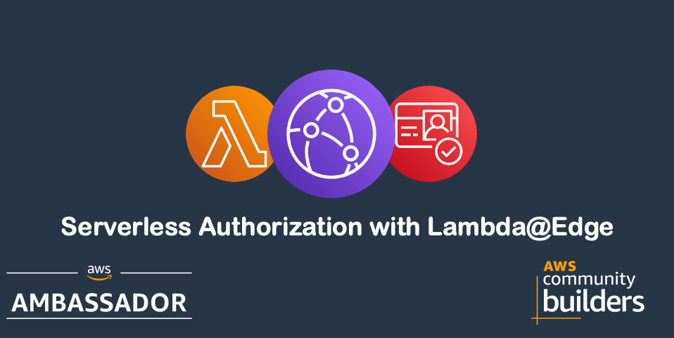
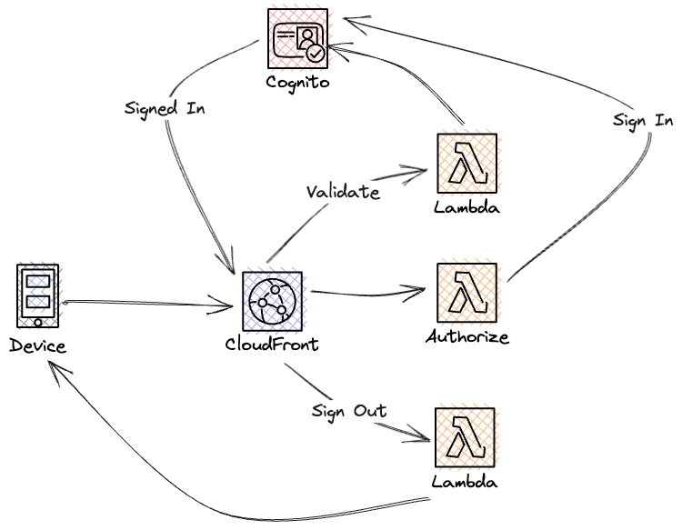
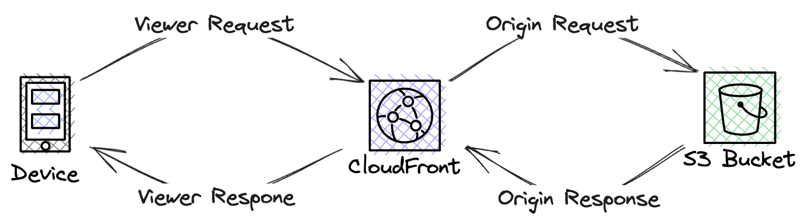

# Solution - Authorization with Lambda@Edge



In this solution you will use StepFunctions HTTP EndPoint state to post a message to Slack.

## Deep Dive

For a full deep dive visit [Protecting a Static Website with JWT and Lambda@Edge](https://jimmydqv.com/cloudfront-serverless-auth/index.html)

## Cost

As this solution is 100% serverless the cost for building and running this tutorial is very low and the cost has a direct correlation to usage. There are no components that cost by the hour, you only pay for what you use / invoke.

## Before you start

The following need to be available on your computer:

* [Install SAM Cli](https://docs.aws.amazon.com/serverless-application-model/latest/developerguide/install-sam-cli.html)

Now, Let's go build!

## Introduction

This solution will use Lambda@Edge and Cognito User Pools to authorize calls made to CloudFront and static content.

Solution overview:  



### CloudFront integration points

There are four different integration points for Lambda@Edge and you can only set one Lambda function as target for each. The integration is done on the cache behavior so if you have several cache behaviors you can setup integration with different functions for each of them. So how does each integration point work?

__Viewer Request__ The Lambda function is invoked as soon as CloudFront receives the call from the client. This function will be invoked on every request.  
__Origin Request__ The Lambda function is invoked after the cache and before CloudFront calls the origin. The function will only be invoked if there is a cache miss.  
__Origin Response__ The Lambda function is invoked after CloudFront receives the response from the origin and before data is stored in the cache.  
__Viewer Response__ The Lambda function is invoked before CloudFront forwards the response to the client.  

In this solution will we only use the __Viewer Request__ integration point.



## Deploying the solution

## How to deploy

This solution show how to setup everything in a different region than us-east-1.

## Deploy UserPool in eu-north-1

Start by updating [eu-north-1/samconfig.yaml](eu-north-1/samconfig.yaml) and add your values.
Deploy using the SAM CLI:

``` bash
sam deploy --config-env prod --template-file eu-north-1/template.yaml 
```

Update [us-east-1/EdgeLambda/samconfig.yaml](us-east-1/samconfig.yaml) and add your values.
Deploy using the SAM CLI:

``` bash
sam deploy --config-env prod --template-file us-east-1/template.yaml
```

Update [eu-north-1/CloudFrontDistribution/samconfig.yaml](eu-north-1/CloudFrontDistribution/samconfig.yaml) and add your values.
Deploy using the SAM CLI:

``` bash
sam deploy --config-env prod --template-file eu-north-1/CloudFrontDistribution/template.yaml
```

## Clean up

To clean everything up delete the CloudFormation stack. This can be done either with SAM Cli command

``` bash
sam delete --stack-name TEXT
```

Or from the [AWS Console](https://eu-west-1.console.aws.amazon.com/cloudformation/home?region=eu-north-1#/stacks)

## Final words

For a full deep dive visit [my blog post on this topic](https://jimmydqv.com/cloudfront-serverless-auth/index.html)