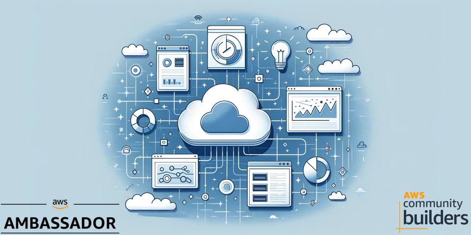
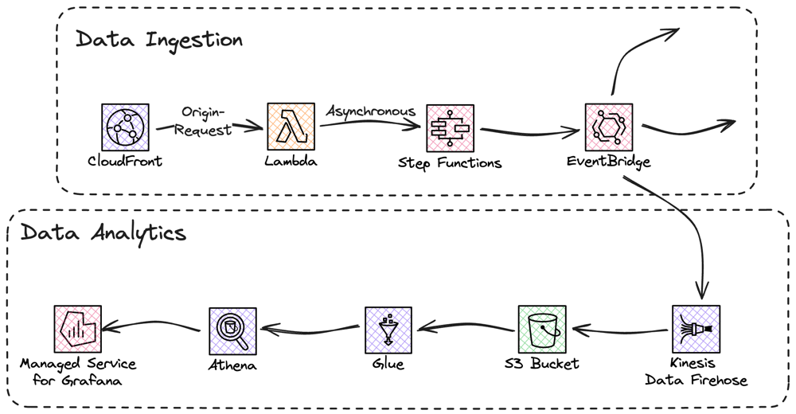

# Solution - Serverless statistics solution with Lambda@Edge



In this solution you will build a serverless statistics solution for a static website served from CloudFront. You will use services like Lambda@Edge, StepFunctions, Glue, and Athena.

For a full deep dive visit [my blog post on this topic](https://jimmydqv.com/statistics-with-lambda-at-edge/index.html)

## Cost

As this solution is 100% serverless the cost for building and running this tutorial is very low and the cost has a direct correlation to usage. There are no components that cost by the hour, you only pay for what you use / invoke.

## Before you start

The following need to be available on your computer:

* [Install SAM Cli](https://docs.aws.amazon.com/serverless-application-model/latest/developerguide/install-sam-cli.html)

Now, Let's go build!

## Architecture overview

There are two parts to this overall architecture, the data ingestion and data analytics.



The two parts has been decoupled for easy extension.

Let's start to deploy this solution.

## Lambda@Edge function in us-east-1

Start by updating [us-east-1/samconfig.yaml](us-east-1/samconfig.yaml) and add your values.
Deploy using the SAM CLI:

``` bash
sam deploy --config-env prod --template-file us-east-1/template.yaml 
```

You will need the full ARN including version for the function in the coming steps.

## Deploy Statistics in eu-north-1

### Common Parts

First you need to deploy the common parts, consisting or StepFunction, and EventBridge.

Start by updating [eu-north-1/Statistics/Common/samconfig.yaml](eu-north-1/Statistics/Common/samconfig.yaml) and add your values. Here you also update if you like to deploy to a different region than eu-north-1

``` bash
sam deploy --config-env prod --template-file eu-north-1/Statistics/Common/template.yaml 
```

### Data Store

Next you need to deploy the DataStore, with FireHose and S3.
Update [eu-north-1/Statistics/DataStores/samconfig.yaml](eu-north-1/Statistics/DataStores/samconfig.yaml) and add your values. Make sure you match the region if you changed in previous steps.

``` bash
sam deploy --config-env prod --template-file eu-north-1/Statistics/DataStores/template.yaml 
```

### Analytics

Next you need to deploy the Analytics, with Glue and Athena.
Update [eu-north-1/Statistics/Analytics/samconfig.yaml](eu-north-1/Statistics/Analytics/samconfig.yaml) and add your values. Make sure you match the region if you changed in previous steps.

``` bash
sam deploy --config-env prod --template-file eu-north-1/Statistics/Analytics/template.yaml 
```

## Deploy CloudFront in eu-north-1

Finally deploy the CloudFront distribution.

Update [eu-north-1/CloudFrontDistribution/samconfig.yaml](eu-north-1/CloudFrontDistribution/samconfig.yaml) and add your values. Make sure you match the region if you changed in previous steps.

``` bash
sam deploy --config-env prod --template-file eu-north-1/CloudFrontDistribution/template.yaml 
```

## Test it

When everything is deployed, you can load a couple of pages from CloudFront, and check that you get data in your S3 bucket.
The crawler is set to run every night, but can be manually invoked, do that to test Athena. First time you use Athena you must set a S3 bucket as query cache.

When that is done you can run queries like this to analyze the data.

``` SQL
select count(*) as visits, "page" from statistics_data where "ViewDate" between '2024-MM-DD' and '2024-MM-DD'  group by "page" order by visits desc
```

## Clean up

To clean everything up delete the CloudFormation stack. This can be done either with SAM Cli command

``` bash
sam delete --stack-name TEXT
```

Or from the [AWS Console](https://eu-west-1.console.aws.amazon.com/cloudformation/home?region=eu-north-1#/stacks)

## Final words

For a full deep dive visit [my blog post on this topic](https://jimmydqv.com/serverless-redirect/index.html)