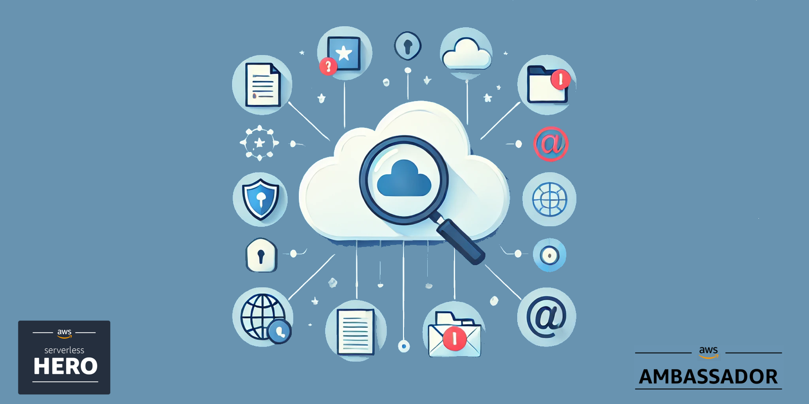

# Solution - Serverless AI powered content moderation service



In this solution you will build a serverless image moderation using Amazon GuardDuty and Rekognition.

For a full deep dive visit [my blog post on this topic](https://jimmydqv.com/image-moderation-extension/index.html)

## Cost

As this solution is 100% serverless the cost for building and running this tutorial is very low and the cost has a direct correlation to usage. There are no components that cost by the hour, you only pay for what you use / invoke.

## Before you start

The following need to be available on your computer:

* [Install SAM Cli](https://docs.aws.amazon.com/serverless-application-model/latest/developerguide/install-sam-cli.html)

Now, Let's go build!

## Architecture overview

In the architecture we add functionality to use GuardDuty S3 malware scanning and Rekognition for image moderation. GuardDuty will scan new files that arrive in the S3 bucket, that I call staging, a tag will will be added to the object and the scan result posted to the default event-bus. The scan result, if OK, will invoke a StepFunction next that utilize Rekognition for image moderation. I have implemented the same logic in this StepFunction and add a tag on the object and post an event onto a event-bus. Finally files are moved to either a quarantine ocr storage bucket.

Every part of the solution is decoupled and can run independently and a saga pattern is applied to move the logic to the next phase.


## Deploy common infrastructure

First part is to deploy the common infrastructure, containing S3 buckets and EventBridge.

Deploy using the SAM CLI:

``` bash
sam deploy --config-env prod --template-file CommonInfra/template.yaml 
```

## Deploy malware scanning

Next part is to configure GuardDuty and malware scanning.

Deploy using the SAM CLI:

``` bash
sam deploy --config-env prod --template-file MalwareScanning/template.yaml 
```

## Deploy image moderation

Next pup is the image moderation part, that will setup the StepFunction to invoke Rekognition.

Deploy using the SAM CLI:

``` bash
sam deploy --config-env prod --template-file ImageModeration/template.yaml
```

## Deploy completed flow

The final part is to deploy the completed flow, that move files to the correct bucket.

Deploy using the SAM CLI:

``` bash
sam deploy --config-env prod --template-file Completed/template.yaml
```

## Testing

To test the solution navigate to the S3 console and upload a file to the staging bucket. Observe the tags that are added to the object and watch it being moved to either storage or quarantine.

For testing the Rekognition part, I recommend using one of the test images coming from the Rekognition console.