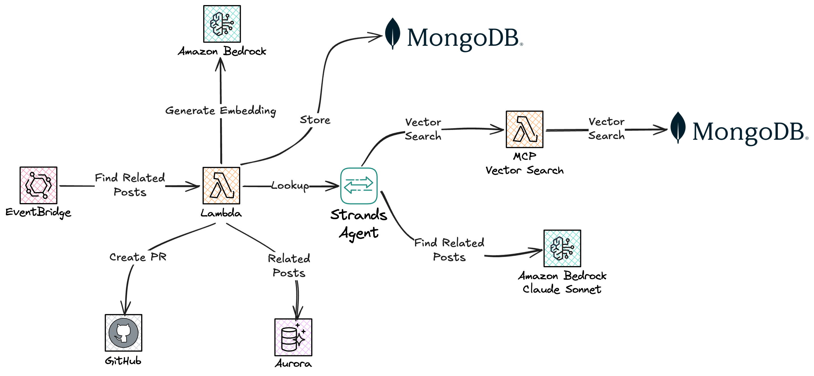
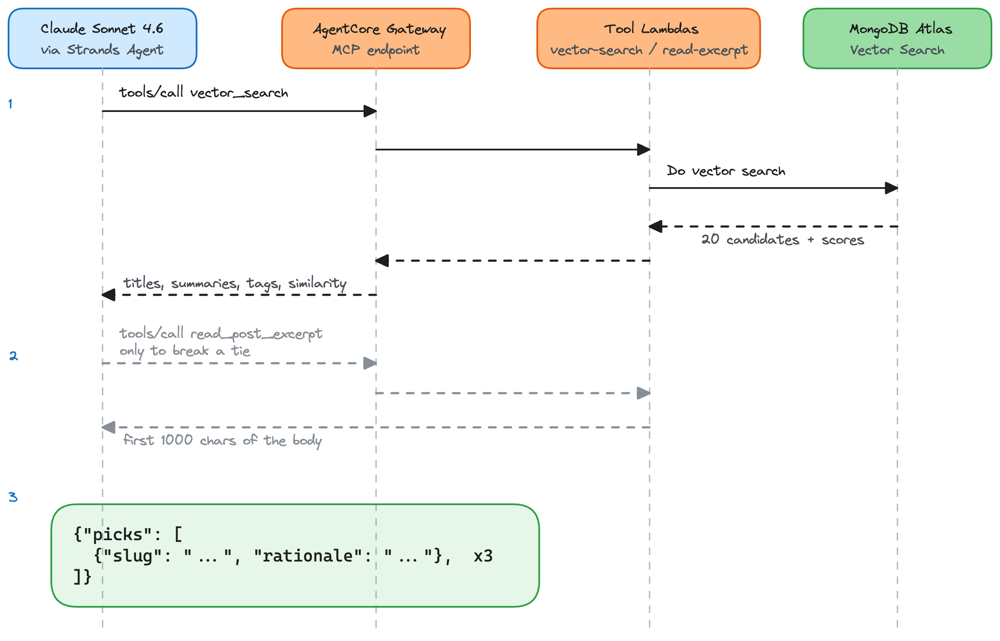

# Solution - Serverless Related Posts Pipeline


*An AI agent picks the three best related posts for every post on the blog, and says why.*

An AI agent that picks the three best related posts for every post on my blog, and explains each pick in one sentence.

Here's the problem it solves. I write a post, someone reads it all the way to the end, and then they leave. A reader who just finished a post about Lambda is probably interested in my other serverless posts. And I did nothing with that moment. No "read this next". Nothing. So I built a pipeline that fixes exactly that.

When a post is published, a single Lambda Durable Function runs the whole flow. It embeds the post with Bedrock Titan Text Embeddings v2, stores the vector in MongoDB Atlas Vector Search, then hands off to a Strands Agent (Claude Sonnet on Bedrock) that reads the nearest candidates through MCP tools served by AgentCore Gateway and picks the three best. The picks land in Amazon DSQL, and a GitHub PR injects a `related_posts:` block into the frontmatter of the affected posts. New posts also re-evaluate their five nearest neighbors, so an old post doesn't stay frozen the day a better match gets published. The link graph heals backwards.

I wrote up the full story, and every decision behind it, on the blog: [Letting an AI Agent Pick My Related Posts](https://jimmydqv.com/serverless-related-posts-pipeline/).


*End to end. EventBridge triggers the durable orchestrator, which embeds with Bedrock, stores in Atlas, runs the agent over MCP tools, writes the picks to DSQL, and opens a GitHub PR.*

## Cost

Everything here is pay per use, and at blog scale it adds up to almost nothing.

MongoDB Atlas runs on the M0 free tier, and Vector Search comes with it. Lambda, EventBridge, and DSQL all stay inside their free tiers when you publish a handful of posts a month. The only real cost is Bedrock inference. A full run is one embedding call plus around six Sonnet calls, which lands somewhere around $0.04 to $0.07. Nothing runs when you're not publishing.

## Key Patterns

- **Retrieve with math, decide with a model.** Atlas `$vectorSearch` narrows the corpus to about 20 candidates. The agent reads those and picks 3, each with a written rationale. Fewer than 3 picks and the run fails closed: no database write, no PR.
- **One durable Lambda owns the workflow.** Every side effect is a `context.step(...)` checkpoint, so a crash or a Bedrock throttle resumes from the last checkpoint instead of re-running expensive work. The backlink re-evaluation is a `context.parallel` fan-out inside the same execution.
- **Managed MCP tool serving.** The agent's tools (`vector_search` and `read_post_excerpt`) are plain Lambdas fronted by AgentCore Gateway, with IAM SigV4 auth on the way in. No MCP server to run, no OAuth issuer to host.
- **No database passwords anywhere.** Atlas access goes through AWS IAM using pymongo's `MONGODB-AWS` mechanism. One dedicated IAM role (its own stack) is federated with Atlas exactly once, and the Lambdas STS-assume it at runtime, so redeploys never touch Atlas. DSQL uses the same assume-role plus token pattern.
- **Content-hash idempotency.** A SHA-256 over the normalized body short-circuits a re-run when nothing meaningful changed. Frontmatter typo fixes and code-fence edits don't trigger an embedding or an agent call.
- **The PR is the human checkpoint.** Picks land in DSQL (the source of truth) and in a reviewable GitHub PR, up to 6 files per run. Closing the PR is the undo button.
- **Shared code without Lambda layers.** The canonical `shared/python/` modules are vendored into each Lambda at build time with `BuildMethod: makefile` and `build_in_source: true`.

## Architecture

Three SAM stacks, deployed in order.

| Stack | Folder | What it owns |
|---|---|---|
| `related-posts-common` | [`common/`](common/) | EventBridge bus, GitHub token secret, Atlas connection secret (both declared with `REPLACE_ME` placeholders) |
| `related-posts-atlas-roles` | [`atlas-roles/`](atlas-roles/) | The single IAM role federated as an Atlas database user |
| `related-posts-service` | [`related-posts-service/`](related-posts-service/) | The pipeline: durable orchestrator, two GitHub Lambdas (Node 22 + Octokit), two MCP tool Lambdas, AgentCore Gateway, EventBridge rule |

Plus two things you bring yourself.

**Amazon DSQL.** The pipeline reads `cms_content.blog_posts.file_path` and writes `cms_content.related_posts`. The tables it needs are in [`database/schema.sql`](database/schema.sql), and access goes through an STS-assumable writer role you point the template at.

**MongoDB Atlas M0.** A cluster, a database, a collection, and a Vector Search index. Full walkthrough in [`related-posts-service/ATLAS_SETUP.md`](related-posts-service/ATLAS_SETUP.md).

The agent loop, on its own:


*Strands drives the loop. It calls `vector_search` and `read_post_excerpt` through AgentCore Gateway, which fronts the tool Lambdas, and the Lambdas talk to Atlas.*

## Prerequisites

- AWS SAM CLI and AWS CLI, with credentials that can deploy
- Python 3.13 and Node.js 22 (the esbuild builds run on your machine)
- Amazon Bedrock model access in your region for `amazon.titan-embed-text-v2:0` and Claude Sonnet. The code uses the `eu.anthropic.claude-sonnet-4-6` EU cross-region inference profile, so if you deploy outside the EU, change `_MODEL_ID` in `lambda/orchestrator/agent.py` and the Bedrock IAM resources in `template.yaml`.
- An Amazon DSQL cluster with the tables from [`database/schema.sql`](database/schema.sql) and an IAM role with `dsql:DbConnectAdmin`
- A MongoDB Atlas account (free), set up in step 2 below
- A GitHub personal access token with `repo` scope for your blog repository

## MongoDB Atlas Setup

Follow [`related-posts-service/ATLAS_SETUP.md`](related-posts-service/ATLAS_SETUP.md). The short version:

1. Create an M0 cluster, a `blog` database with a `posts` collection, and the `posts_vector_idx` Vector Search index (1024 dimensions, cosine, with `language` as a filter field).
2. Deploy the `atlas-roles` stack (step 3 below) and federate the role ARN it outputs as an **AWS IAM database user** in Atlas, with `readWrite` on `blog.posts`. You do this once, ever. Lambda redeploys never repeat it.
3. Put the cluster's SRV connection string into the Atlas secret created by the `common` stack.

## Configuration

| Placeholder | File | Description |
|---|---|---|
| `<YOUR_GITHUB_OWNER>` / `<YOUR_BLOG_REPO>` | `related-posts-service/samconfig.yaml` | The GitHub repository holding your blog's markdown |
| `<YOUR_CLUSTER_ID>.dsql...` | `related-posts-service/samconfig.yaml` | Your DSQL cluster endpoint |
| `arn:aws:iam::...:role/...` | `related-posts-service/samconfig.yaml` | The DSQL writer role the Lambdas STS-assume |
| `<YOUR_DSQL_DB_USER>` | `related-posts-service/samconfig.yaml` | The DSQL database user mapped to that role |
| `REPLACE_ME` (GitHub token) | Secrets Manager console, after deploying `common` | `{"token": "ghp_..."}` |
| `REPLACE_ME` (Atlas SRV URI) | Secrets Manager console, after deploying `common` | From Atlas, under Connect, Drivers, Python |

All stacks default to `Application=related-posts`. Override it in each `samconfig.yaml` if you want different resource naming (the S3 staging bucket name has to be globally unique).

## Deployment

Deploy in this order, each step from its own folder with `sam build && sam deploy`.

**1. Common (bus and secrets):**

```bash
cd common
sam build && sam deploy
```

Then open Secrets Manager and replace both `REPLACE_ME` values. The GitHub token now, the Atlas SRV URI after step 2 of the Atlas setup.

**2. Atlas roles:**

```bash
cd atlas-roles
sam build && sam deploy
```

Capture the `BlogPipelineAtlasRWRoleArn` output and federate it in Atlas (see Atlas setup above).

**3. The pipeline:**

```bash
cd related-posts-service
sam build && sam deploy
```

One note on the build. `sam build` uses `build_in_source: true` (set in `samconfig.yaml`) so the per-function Makefiles can vendor `shared/python/` into the artifacts, and those Makefiles pip-install with explicit `manylinux_aarch64` platform flags so native wheels (psycopg2) match Lambda. Don't remove either.

**4. Trigger it.** Put an event on the bus for one of your posts:

```bash
aws events put-events --entries '[{
  "Source": "blog.cms",
  "DetailType": "PostPublished",
  "EventBusName": "related-posts-events",
  "Detail": "{\"slug\": \"my-post-slug\", \"language\": \"en\", \"branch\": \"main\", \"commit_sha\": \"<sha>\"}"
}]'
```

Watch the orchestrator's CloudWatch Logs (structured JSON, and every handler prints its incoming event). On success you'll find rows in `cms_content.related_posts` and an open PR on your blog repo. The orchestrator also emits `RelatedPostsCompleted` and `RelatedPostsFailed` events on the same bus, in case you want to hook up notifications.

## Cleanup

```bash
cd related-posts-service && sam delete
cd ../atlas-roles && sam delete
cd ../common && sam delete   # secrets and bus are Retain, delete them manually if you want them gone
```

Delete the Atlas cluster and the DSQL tables separately.

## Deep Dive

- The full write-up: [Letting an AI Agent Pick My Related Posts](https://jimmydqv.com/serverless-related-posts-pipeline/). The why behind every piece, with the embedding, the agent loop, and the durable replay model explained in detail.
- [`related-posts-service/ATLAS_SETUP.md`](related-posts-service/ATLAS_SETUP.md), the full Atlas and IAM federation walkthrough, including why a dedicated shared role beats federating Lambda execution roles.
