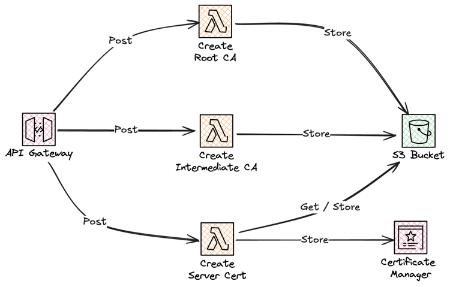

# Solution - Serverless Self Service Certificate Management


In this solution you will build a serverless self service certificate management solution.

For a full deep dive visit [my blog post on this topic](https://jimmydqv.com/self-service-certs-part-1/index.html)

## Cost

As this solution is 100% serverless the cost for building and running this tutorial is very low and the cost has a direct correlation to usage. There are no components that cost by the hour, you only pay for what you use / invoke.

## Before you start

The following need to be available on your computer:

* [Install SAM Cli](https://docs.aws.amazon.com/serverless-application-model/latest/developerguide/install-sam-cli.html)

Now, Let's go build!

## Architecture overview

We will build this completely serverless using Amazon API Gateway and Lambda functions, with storage of the certificates in S3 and Certificate Manager. 



## Deploy common infrastructure

First part is to deploy the common infrastructure, containing S3 bucket.

Deploy using the SAM CLI:

``` bash
sam deploy --template-file CommonInfra/template.yaml 
```

## Deploy the API

Next part is to build and deploy the API

Deploy using the SAM CLI:

``` bash
sam build

sam deploy --template-file MalwareScanning/template.yaml 
```
