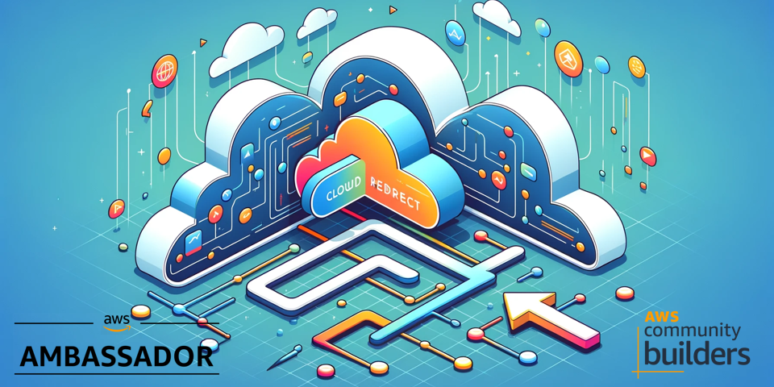
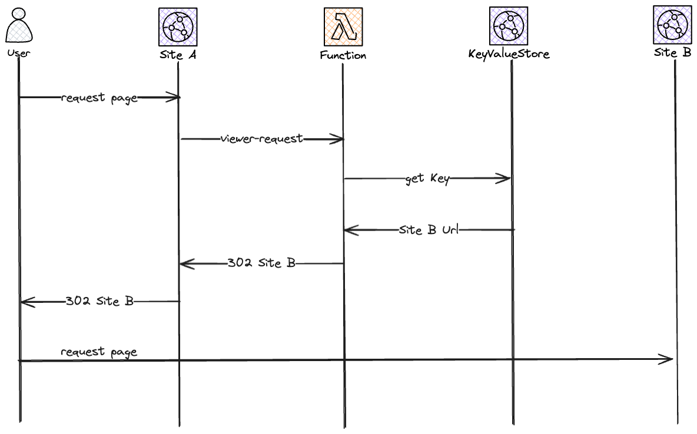

# Solution - A severless URL redirect



In this solution you will build a serverless URL redirect using CloudFront functions and CloudFront key-value stores.

## Cost

As this solution is 100% serverless the cost for building and running this tutorial is very low and the cost has a direct correlation to usage. There are no components that cost by the hour, you only pay for what you use / invoke.

## Before you start

The following need to be available on your computer:

* [Install SAM Cli](https://docs.aws.amazon.com/serverless-application-model/latest/developerguide/install-sam-cli.html)

Now, Let's go build!

## Introduction

In this solution we'll create an an easy way to do redirects from one domain, example.com to a different domain, example-2.com. We'll also be able to redirect example.com/abc and redirect that to example-2.com/xyz with an path mapping. We'll create an API for adding and removing these mappings.

## Architecture overview

There are two parts to this overall architecture, the actual redirect part in CloudFront and a simple API to add and remove mapping keys, powered by ApiGateway and StepFunctions.


To get into some more details, the call flow when a user is redirected would be.



Let's start to deploy this solution, but before we start.

## KeyValueStore limitations

When starting to work with CloudFront KeyValueStores there are some things you need to understand.

The store has the following limits:
* Total size – 5 MB
* Key size – 512 characters
* Value size – 1024 characters

That means that you need to keep your KeyValueStored trimmed, you can't create a massive amount of key value pairs and you can't store massive amount of data, you can't use it as a database. In a normal use-case these limits should not be a problem.

When working with a KeyValueStore you not only need the ARN of the store, you also need the ETag representing the last version of the store. This is important to remember when adding and removing keys.

It's also important to understand that updates are eventual consistent, it does take a couple of seconds for a change to replicate across edge locations.

## Deploy SSL cert in us-east-1

Start by updating [us-east-1/samconfig.yaml](us-east-1/samconfig.yaml) and add your values.
Deploy using the SAM CLI:

``` bash
sam deploy --config-env prod --template-file us-east-1/template.yaml 
```

## Deploy solution in eu-north-1

Start by updating [eu-north-1/samconfig.yaml](eu-north-1/samconfig.yaml) and add your values. Here you also update if you like to deploy to a different region than eu-north-1

``` bash
sam deploy --config-env prod --template-file eu-north-1/template.yaml 
```

## Clean up

To clean everything up delete the CloudFormation stack. This can be done either with SAM Cli command

``` bash
sam delete --stack-name TEXT
```

Or from the [AWS Console](https://eu-west-1.console.aws.amazon.com/cloudformation/home?region=eu-north-1#/stacks)

## Final words

For a full deep dive visit [my blog post on this topic](https://jimmydqv.com/serverless-redirect/index.html)