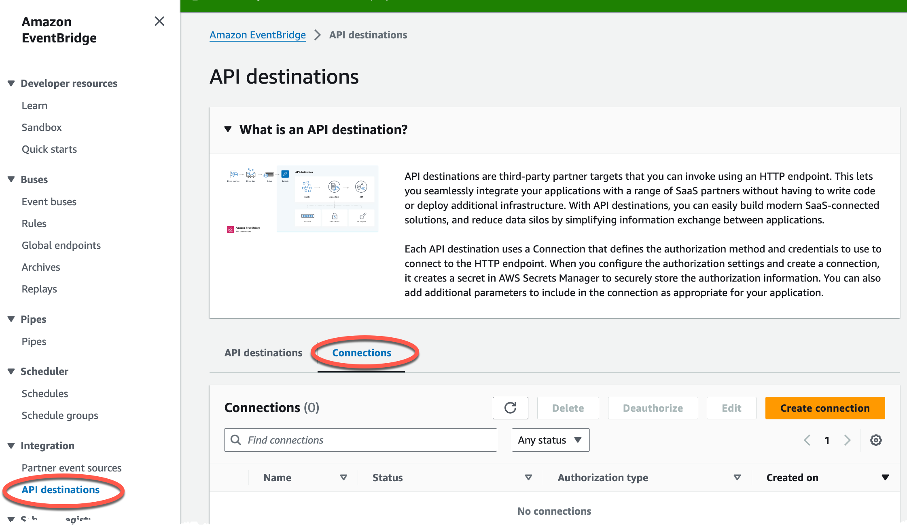
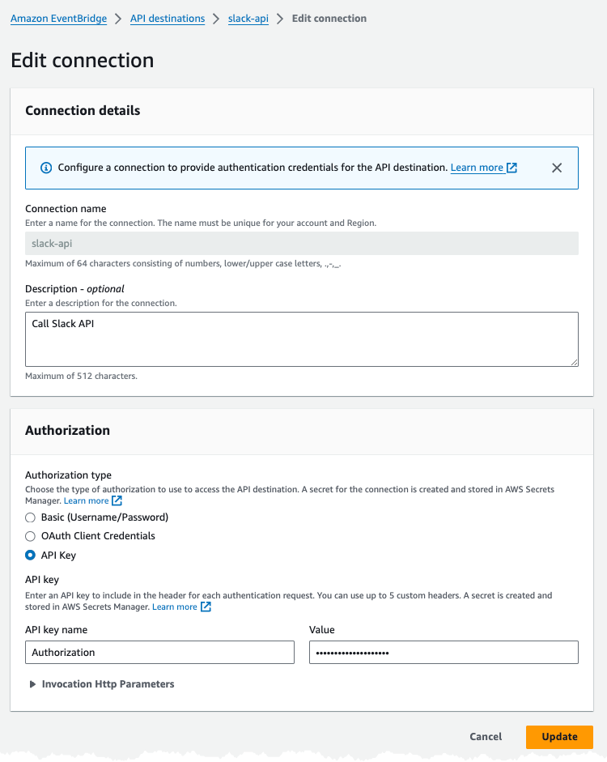
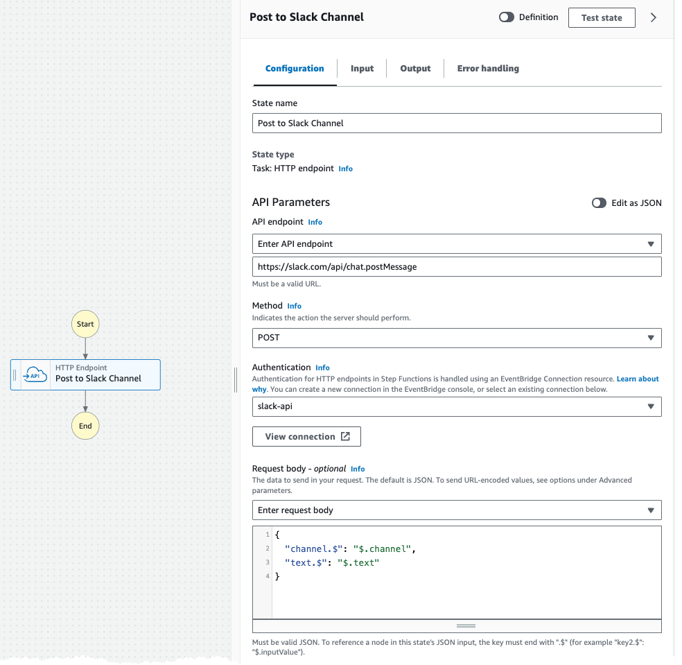

# Solution - A Slack Channel Poster using StepFiunctions HTTP EndPOint


In this solution you will use StepFunctions HTTP EndPOint state to post a message to Slack.

## Cost

As this solution is 100% serverless the cost for building and running this tutorial is very low and the cost has a direct correlation to usage. There are no components that cost by the hour, you only pay for what you use / invoke.

## Before you start

The following need to be available on your computer:

* [Install SAM Cli](https://docs.aws.amazon.com/serverless-application-model/latest/developerguide/install-sam-cli.html)
* You need a Slack workspace and a Slack Application, see [AWS StepFunctions HTTP Endpoint demystified](https://jimmydqv.com/stepfunctions-http-api/index.html)

Now, Let's go build!

## EventBridge Connection

To call an API using a HTTP Endpoint state a EventBridge Connection is required. This so we don't have to hard code or include any authorization parameters in our StateMachine.

EventBridge Connection can be found under EventBridge API Destinations and connections. StepFunctions HTTP Endpoints reuse this functionality.



## Post to Slack

For the EventBridge Connection used to Post to Slack the API Authentication is used, setting the header as follows:



In the Body we need to supply the text and channel, we supply that as input parameters to the StepFunction invocation.



When calling the API from a StepFunction we need to set the Content-Type header, Slack doesn't parse our data and determine if it's json or not. This is done under Advanced Parameters.


## Deploy solution

This solution will be deployed to eu-north-1 if you like to use a different Region update  [samconfig.yaml](samconfig.yaml).

Run command:

``` bash
sam deploy --config-env default --template-file template.yaml 
```

The template creates a secret in SecretsManager called: _/slack/app/token_ update this and add your own Slack App OAuth token.

## Test it

Invoke the StepFunction and supply the parameters needed.


## Clean up

To clean everything up delete the CloudFormation stack. This can be done either with SAM Cli command

``` bash
sam delete --stack-name TEXT
```

Or from the [AWS Console](https://eu-west-1.console.aws.amazon.com/cloudformation/home?region=eu-north-1#/stacks)

## Final words

For a full deep dive visit [my blog post on this topic](https://jimmydqv.com/serverless-redirect/index.html)