# Tutorial - Run a Java service on ECS and Fargate


In this tutorial you will learn how to setup an ECS Cluster and how to run a Java SpringBoot application as a service in the cluster. The service will run on Fargate, eliminating the need for any underlying EC2 instances.

## Architecture Overview

First of all, let us do an overview of the architecture that we need to create. When running a container workload on ECS we need to create a VPC to run in. We'll create a VPC with two public, two private subnets, a NAT Gateway in each public subnet (with routing from the private), an Internet Gateway, and of course all the needed Security Groups. There will be one Application Load Balancer (ALB) that spans both of the public subnets, the ALB will send traffic to the Fargate based containers running in the ECS cluster in each of the private subnets. Container images will be pulled from ECR by ECS when starting up new containers. Fairly basic architecture, so let's go build!


## Cost

The cost for running this tutorial and keep it up and running is around $0.15 / hour. This solution is not free, make sure you tear it down when you are done!

## Before you start

The following need to be available on your computer:

* [Install SAM Cli](https://docs.aws.amazon.com/serverless-application-model/latest/developerguide/install-sam-cli.html)
* [Install Docker](https://docs.docker.com/engine/install/)
* [Install Java](https://www.java.com/en/download/help/download_options.html)
* [Install Gradle](https://gradle.org/install/)
* [Follow SpringBoot getting started](https://docs.spring.io/spring-boot/docs/current/reference/html/getting-started.html)

Now, Let's go build!

## Deploy VPC

The first thing that need to be done is to deploy the VPC, deploy the [VPC section](aws-infrastructure/vpc/). The samconfig.yaml file is configured to deploy to eu-west-1 and will create a 10.6.0.0/16 VPC.

``` bash
sam deploy --config-env default --template-file aws-infrastructure/vpc/template.yaml 
```

After deployment you should have a VPC looking like this.

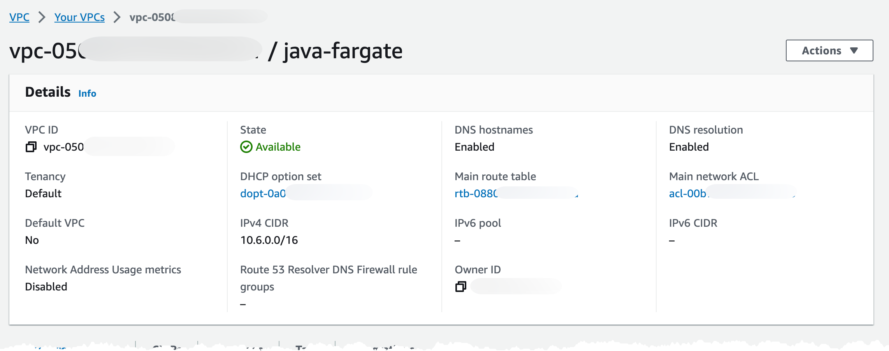

Also verify the routing information

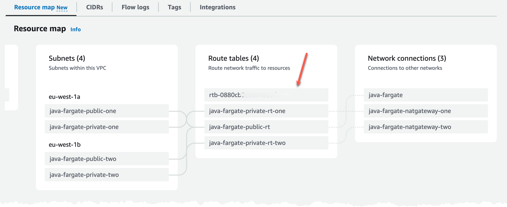

## Deploy ECS and ALB

With the VPC in place we can deploy the ECS cluster and the ALB. And create the security groups needed for communication.

In this scenario you need a hosted zone in Route53, so you can create use secure connections to the ALB, HTTPS. You need to create an DNS record and an certificate in Certificate Manager. If you don't have an Route53 hosted zone to create DNS records in, you need to change the ALB security group and listener to port 80 instead of port 443.

Deploy the [Service section of the infrastructure](aws-infrastructure/service/), you need to supply values for DomainName and HostedZoneId in samconfig.yaml, with that done run command.

``` bash
sam deploy --config-env default --template-file aws-infrastructure/service/template.yaml 
```

After deployment verify the ECS Cluster.

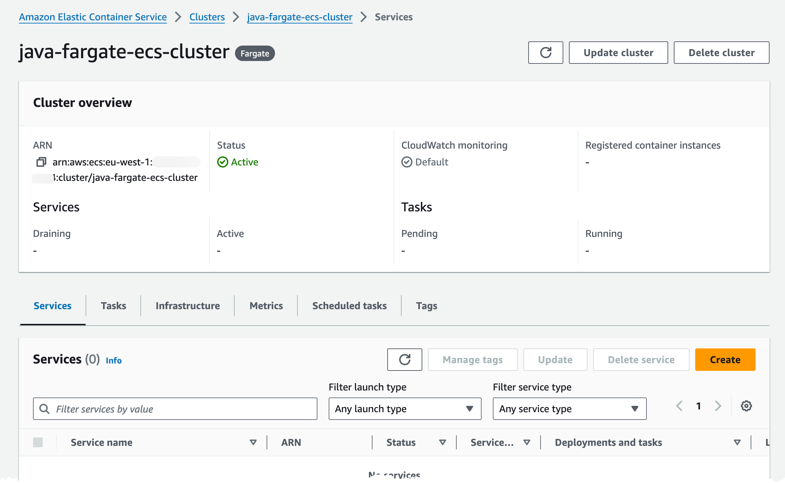

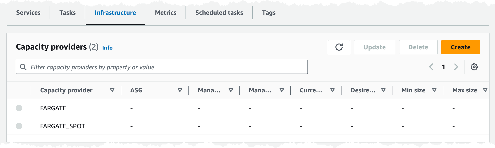

The ALB should be deployed to two subnets.

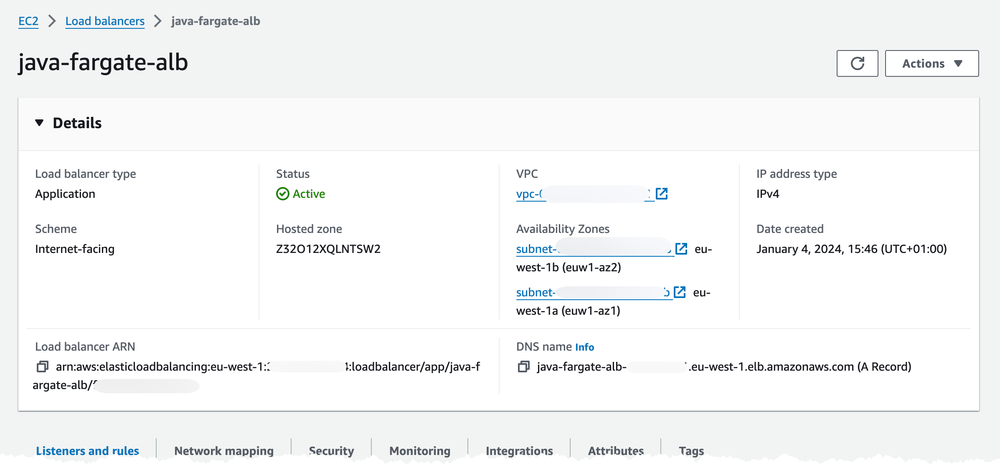

In the Listeners and rules tab, check that you got one listener rule with a fixed 503 response, on port 443.

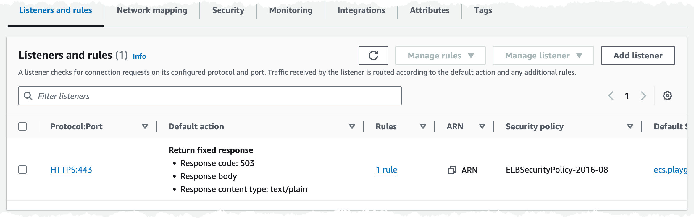

In the Security tab we have one Security Group associated, check that group is should allow traffic on port 443 from internet.

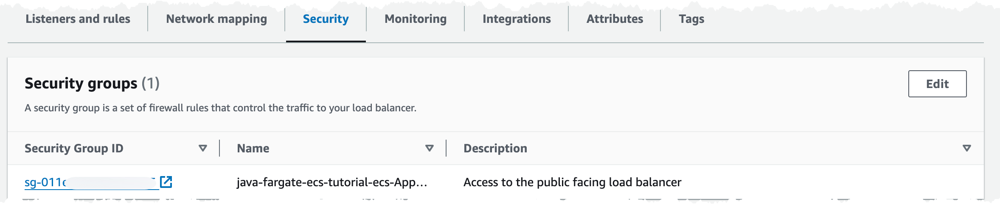

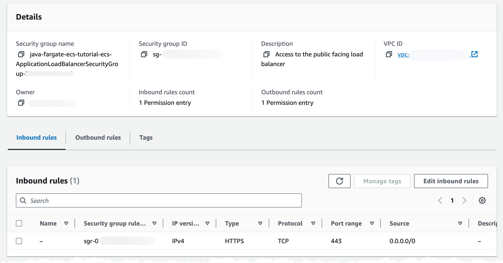

You can check that you get a 503 response back by navigating to the DNS record you supplied.

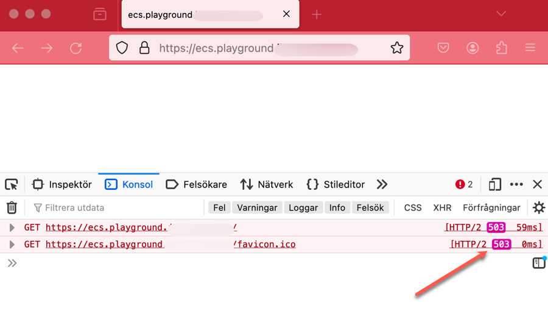

## Deploy ECR

The first thing the application service needs is an ECR repository where you can push our images. To create that deploy the [ECR template](java-service/infrastructure/ecr-repository).

``` bash
sam deploy --config-env default --template-file java-service/infrastructure/ecr-repository/template.yaml 
```

In the console you should see an empty repository looking like this.

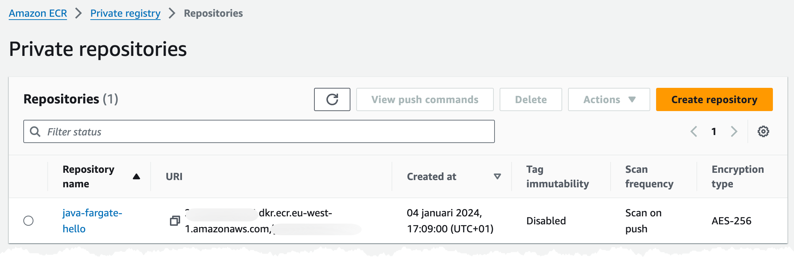

## Build and push application image

In the [Application folder](java-service/application) make sure you can build the project using command

``` bash
./gradlew clean build
```

Build the  Docker image using docker buildx command,.

``` bash
docker buildx build --platform linux/amd64 -t java-demo:latest .
```

To run and test this locally run command

``` bash
docker run -p 8080:8080 java-demo:latest
```

Open up [http://localhost:8080/hello](http://localhost:8080/hello) in the browser, that should render a Hello World response.

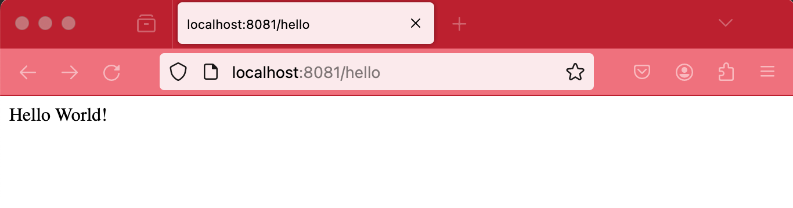

When things are running we can push the image to ECR and continue the deployment.

When pushing an image to ECR you need to authenticate Docker to the login-password using the [get-login-password](https://awscli.amazonaws.com/v2/documentation/api/latest/reference/ecr/get-login-password.html) cli command. More details in the [documentation](https://docs.aws.amazon.com/AmazonECR/latest/userguide/registry_auth.html).

Run command, make sure to replace REGION and AWS_ACCOUNT

``` bash
aws ecr get-login-password --region REGION | docker login -u AWS --password-stdin AWS_ACCOUNT.dkr.ecr.eu-west-1.amazonaws.com

IMAGE="AWS_ACCOUNT.dkr.ecr.eu-west-1.amazonaws.com/REPOSITORY_NAME:TAG"
docker buildx build --platform linux/amd64 --push -t $IMAGE .
```

You should have an image in your ECR repository.

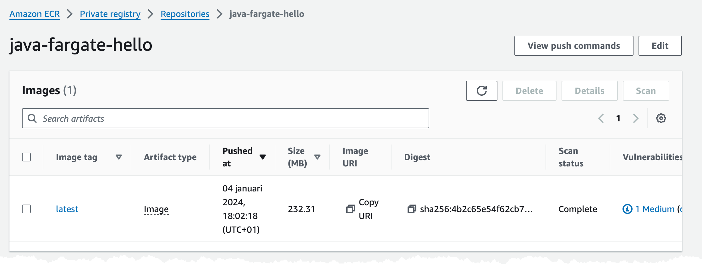

You can also get the a description of the image push commands in the console.

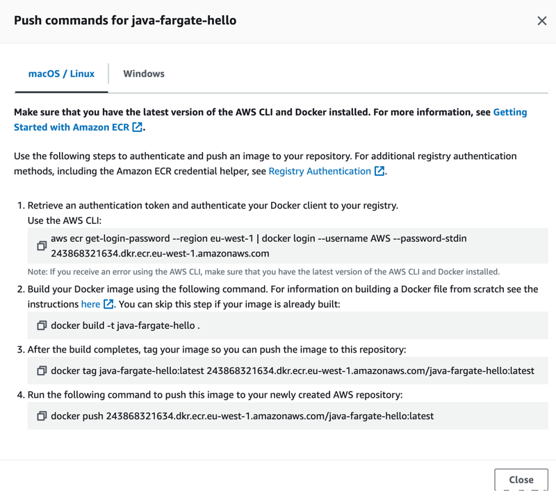

## Deploy service infrastructure

The Java application need AWS Infrastructure to run in, and that is next up for deployment. There need to be a listener rule for the ALB and a Service in the ECS Cluster.

Deploy the [ecs-alb template](java-service/infrastructure/ecs-alb).

``` bash
sam deploy --config-env default --template-file java-service/infrastructure/ecs-alb/template.yaml 
```

This deployment can take some time.

When deployment has finished, verify the ECS cluster, it should show one service with 1/1 Running Task.

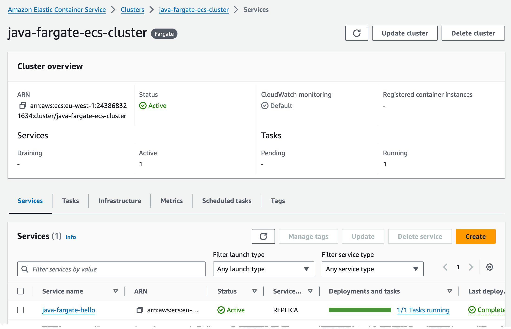

Navigating to the DNS record you created you should now see a Hello World message.

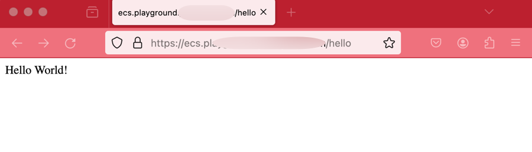

## Clean up

To clean everything up delete the CloudFormation stacks in reverse order. This can be done either with SAM Cli command

``` bash
sam delete --stack-name TEXT
```

Or from the [AWS Console](https://eu-west-1.console.aws.amazon.com/cloudformation/home?region=eu-west-1#/stacks)

## Final words

For a full deep dive visit [my blog post on this topic](https://jimmydqv.com/java-application-on-ecs-fargate/index.html)