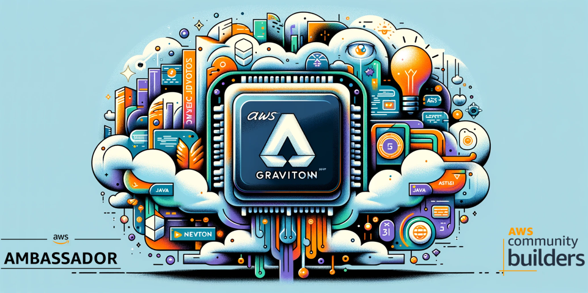
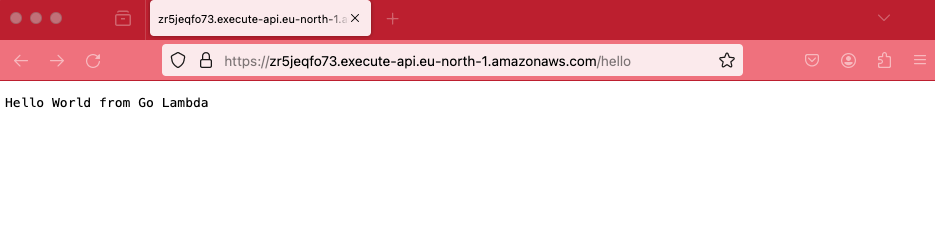
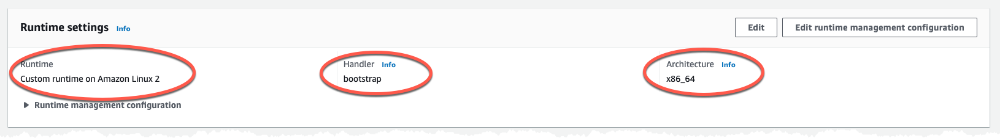
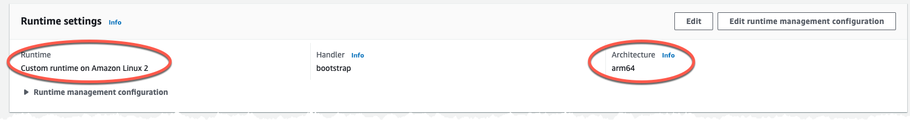

# Tutorial - Migrate Golang based Lambda function to Graviton



In this tutorial you will learn what changes to make to migrate a Golang based Lambda function from X86 to Graviton (ARM) based CPU. You will first deploy the function running on X86 followed by moving it to Graviton.

## Cost

As this solution is 100% serverless the cost for building and running this tutorial is very low and the cost has a direct correlation to usage. There are no components that cost by the hour, you only pay for what you use / invoke.

## Before you start

The following need to be available on your computer:

* [Install SAM Cli](https://docs.aws.amazon.com/serverless-application-model/latest/developerguide/install-sam-cli.html)
* [Install Golang](https://go.dev/doc/install)

Now, Let's go build!

## Deploy Lambda function and API Gateway

When running a Golang Lambda function there is no managed runtime that can be use with Graviton. We need to use the Amazon Linux based provided.al2 runtime.

The SAM template, in this folder, will create two resources. An API Gateway and a Lambda function, the API Gateway will be a HTTP version. The Lambda function will be integrated with the API Gateway and will respond on /hello path on a Get method.

When running on the provided.al2 runtime the handler need to be named bootstrap, which we also declare in the template. The build method need to be specified in the meta-data section of the function. This build will use a [Make](hello-world/Makefile) file when building. The Make file is not that complex for this function. GOARCH is set to amd64 architecture to run on X86.

Build the function by running the SAM build command. Next would be to deploy the function using SAM deploy.
Run the following commands:

``` bash

sam build

sam deploy --config-env default --template-file template.yaml 

```

This will create a CloudFormation stack named 'http-api-lambda-golang-graviton-tutorial' in Region eu-north-1 (Stockholm), to change Region or stack name update the 'samconfig.yaml' file with your preferred values.

``` yaml
....

    parameters:
      stack_name: <STACK NAME>
      region: <REGION>
....
```

The code for the Golang Lambda function is found in the [hello-world](hello-world/main.go) directory and is a simple Hello World.

The Golang code is really simple and just return a status 200 and a message.

``` golang
func handler(request events.APIGatewayProxyRequest) (events.APIGatewayProxyResponse, error) {
	return events.APIGatewayProxyResponse{
		Body: "Hello World from Go Lambda",
		StatusCode: 200,
	}, nil
}
```

From the CloudFormation stack output locate the API endpoint and test that you get a proper response back, don't forget to append /hello to the endpoint since that is the path we set in the integration.



Then head over to the AWS Console and verify that the function is running on X86 based CPU.



### Migrate Golang Lambda to Graviton

The migration to Graviton for Golang is fairly straight forward.

First of all we need to update our [Make](hello-world/Makefile) file so we build for arm based CPU instead of the amd64 we did before, we set the GOARCH to arm64. Modify it to be:

``` Make
build-HelloWorldFunction:
	GOOS=linux GOARCH=arm64 go build -o bootstrap main.go
	cp ./bootstrap $(ARTIFACTS_DIR)/.
```

Update the template and set the Architectures to arm64, bring the commented out Architectures section back.

``` diff-yaml

  HelloWorldFunction:
    Type: AWS::Serverless::Function
    Metadata:
      BuildMethod: makefile
    Properties:
+     Architectures:
+       - arm64
      CodeUri: hello-world/
      Handler: bootstrap
      Runtime: provided.al2
      Events:
        HelloGet:
          Type: HttpApi
          Properties:
            Path: /hello
            Method: get
            ApiId: !Ref HttpApi

```

This will make the function run on Graviton instead of X86. Run the build and deploy command once agin.

``` bash

sam build

sam deploy --config-env default --template-file template.yaml 

```

After the deployment head over to the Console and verify the function architecture, it should show ARM.



## Clean up

To clean everything up delete the CloudFormation stack. This can be done either with SAM Cli command

``` bash
sam delete --stack-name TEXT
```

Or from the [AWS Console](https://eu-west-1.console.aws.amazon.com/cloudformation/home?region=eu-north-1#/stacks)

## Final words

For a full deep dive visit [my blog post on this topic](https://jimmydqv.com/graviton-three-ways/index.html)