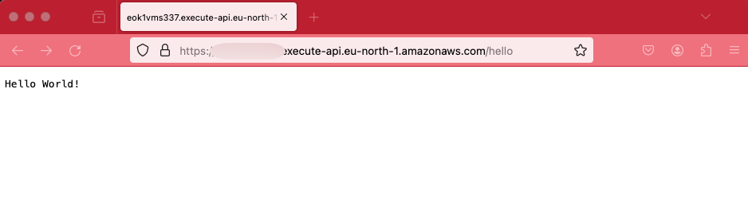
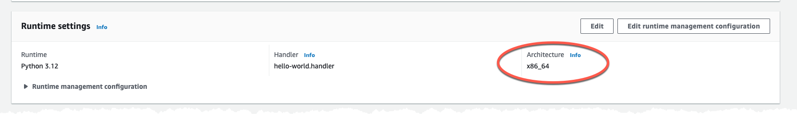
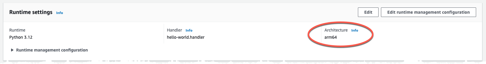

# Tutorial - Migrate Python based Lambda function to Graviton


In this tutorial you will learn what changes to make to migrate a Python based Lambda function from X86 to Graviton (ARM) based CPU. You will first deploy the function running on X86 followed by moving it to Graviton.

## Cost

As this solution is 100% serverless the cost for building and running this tutorial is very low and the cost has a direct correlation to usage. There are no components that cost by the hour, you only pay for what you use / invoke.

## Before you start

The following need to be available on your computer:

* [Install SAM Cli](https://docs.aws.amazon.com/serverless-application-model/latest/developerguide/install-sam-cli.html)
* [Install Python](https://www.python.org/downloads/)

Now, Let's go build!

## Deploy Lambda function and API Gateway

The SAM template, in this folder, will create two resources. An API Gateway and a Lambda function, the API Gateway will be a HTTP version. The Lambda function will be integrated with the API Gateway and will respond on /hello path on a Get method.

Deploy the template using SAM CLI, run command:

``` bash
sam deploy --config-env default --template-file template.yaml 
```

This will create a CloudFormation stack named 'http-api-lambda-python-graviton-tutorial' in Region eu-north-1 (Stockholm), to change Region or stack name update the 'samconfig.yaml' file with your preferred values.

``` yaml
....

    parameters:
      stack_name: <STACK NAME>
      region: <REGION>
....
```

The code for the Python Lambda function is found in the [src](src/) directory and is a simple Hello World.

The Python code is really simple and just return a status 200 and a message.

``` python
def handler(event, context):
    return {"statusCode": 200, "body": "Hello World From Python!!"}
```

From the CloudFormationstack output locate the API endpoint and test that you get a proper response back, don't forget to append /hello to the endpoint since that is the path we set in the integration.



Then head over to the AWS Console and verify that the function is running on X86 based CPU.



### Migrate Python Lambda to Graviton

Next make the changes needed to run the function on Graviton instead of X86. In the template bring the commented out Architectures section back.

``` diff-yaml

  HelloWorldFunction:
    Type: AWS::Serverless::Function
    Properties:
+     Architectures:
+       - arm64
      CodeUri: src/
      Handler: hello-world.handler
      Events:
        HelloGet:
          Type: HttpApi
          Properties:
            Path: /hello
            Method: get
            ApiId: !Ref HttpApi
```

This will make the function run on Graviton instead of X86. Run the deploy command once agin.

``` bash
sam deploy --config-env default --template-file template.yaml 
```

After the deployment head over to the Console and verify the function architecture, it should show ARM.



## Clean up

To clean everything up delete the CloudFormation stack. This can be done either with SAM Cli command

``` bash
sam delete --stack-name TEXT
```

Or from the [AWS Console](https://eu-west-1.console.aws.amazon.com/cloudformation/home?region=eu-north-1#/stacks)

## Final words

For a full deep dive visit [my blog post on this topic](https://jimmydqv.com/graviton-three-ways/index.html)