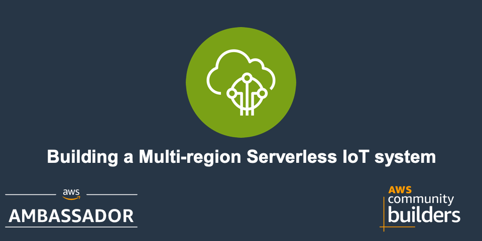
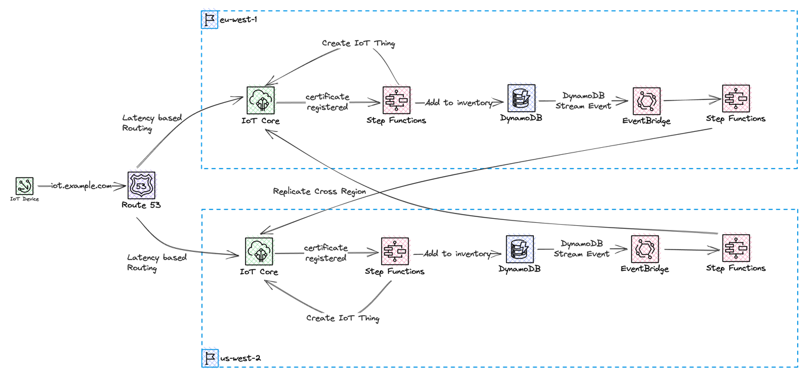

# Tutorial - Create Multi-Region IoT Core setup



In this tutorial we will take a look at how to build a multi-region serverless IoT system. You will learn concepts like how to replicate certificates across regions, and how to setup a DNS record for device connection. All in an event-driven and serverless way.

## Deep Dive Blog Post

See my post on community.aws for a deep dive.
[Building a Multi-region Serverless IoT system](https://community.aws/posts/building-a-multi-region-serverless-iot-system)

## Cost

As this solution is 100% serverless the cost for building and running this tutorial is very low and the cost has a direct correlation to usage. There are no components that cost by the hour, you only pay for what you use / invoke.

## Before you start

The following need to be available on your computer:

* [Install SAM Cli](https://docs.aws.amazon.com/serverless-application-model/latest/developerguide/install-sam-cli.html)

Now, Let's go build!

## Architectural overview

What we are building in this tutorial is an architecture that will span two AWS Regions, with devices connecting to the closest region using Route53. AWS StepFunctions state-machine will act on incoming events from IoT Core and carry out the needed work.



We will use an [configurable endpoint](https://docs.aws.amazon.com/iot/latest/developerguide/iot-custom-endpoints-configurable.html) with a custom domain: iot.example.com. This will be configured in two regions and we'll use a latency-based record to let devices connect to the Region closest to them. When devices connect for the very first time, the device certificate will be registered in IoT Core, using Just In Time Registration. If a device certificate is successfully registered and activated, it will be stored in an device registry, which is a Global DynamoDB table. By utilizing DynamoDB Streams, the replication of the device certificate can be done in an event-driven way, by utilizing EventBridge Pipes and a custom event-bus. Devices will use certificates issued by a self-signed Root CA. When we authenticate our devices towards AWS IoT Core, we will be using Mutual TLS.

Data from the IoT devices will be stored in a Global DynamoDB table to allow access from both regions. Throughout this blog post we will be using us-west-2 (Oregon) and eu-west-1 (Ireland) region when we build and create resources.

## Creating device registry and data table

We will create two global DynamoDB tables that will only be deployed to a single Region but configured with a replica in a second Region. We need a way to keep track of the devices that have already been registered, despite which Region it was initially registered in. For this, we will create a Device Inventory table. For testing purposes, we will also create a global DynamoDB table where we can store data coming from the devices.

Tables are specified in template [Link to template file](src/service/GlobalShared/template.yaml)
Deploy the template with SAM:

``` bash
sam deploy --config-env default --template-file src/service/GlobalShared/template.yaml
```

## Creating Certificates

Next step is to create the certificates that we need. We are going to use a self-signed Root CA when issuing server and device certificates. [Read this to learn more about SSL/TLS certificates](https://aws.amazon.com/what-is/ssl-certificate/). [Read this to learn more about the process](https://www.golinuxcloud.com/openssl-create-certificate-chain-linux/) that we will be using to create the certificates. We will be using [OpenSSL](https://www.openssl.org/) when creating certificates.

First you need to create the proper folder structure. Run the script in [src/certificates/](src/certificates/create-folder-structure.sh)

``` bash
./src/certificates/create-folder-structure.sh
```

First you have to create the Root CA, Run the script in [src/certificates/create-root-ca.sh](src/certificates/create-root-ca.sh) or the commands below.

``` bash
# Root CA:
openssl genrsa -out ./myCA/rootCA/private/ca.key 4096
openssl req -config ./myCA/ca_root.cnf -key ./myCA/rootCA/private/ca.key -new -x509 -days 7300 -sha256 -extensions v3_ca -out ./myCA/rootCA/certs/ca.crt -subj "/C=SE/ST=Scania/L=Malmo/O=MyOrg/OU=/CN=Root CA"
```

Next you have to create the Intermediate CA, Run the script in [src/certificates/create-intermediate-ca.sh](src/certificates/create-intermediate-ca.sh) or the commands below.

``` bash
# Intermediate CA:
openssl genrsa -out ./myCA/intermediateCA/private/ca_intermediate.key 4096
openssl req -config ./myCA/ca_intermediate.cnf -key ./myCA/intermediateCA/private/ca_intermediate.key -new -sha256 -out ./myCA/intermediateCA/csr/ca_intermediate.csr -subj "/C=SE/ST=Scania/L=Malmo/O=MyOrg/OU=/CN=Intermediate CA"
openssl ca -config ./myCA/ca_root.cnf -extensions v3_intermediate_ca -days 3650 -notext -md sha256 -in ./myCA/intermediateCA/csr/ca_intermediate.csr -out ./myCA/intermediateCA/certs/ca_intermediate.crt

# Create Certificate Bundle / Certificate Chain.
cat ./myCA/intermediateCA/certs/ca_intermediate.crt ./myCA/rootCA/certs/ca.crt > ./myCA/intermediateCA/certs/ca-chain.crt.pem
```

Continue to create the server certificate. The process is very similar to the one when creating the Intermediate CA. When the server certificate is created, it's very important that the CommonName is set to the server FQDN, in our case iot.example.com.

Run the script in [src/certificates/create-server-certificate.sh](src/certificates/create-server-certificate.sh) or the commands below.

``` bash
# Server Certificate
openssl genrsa -out ./myCA/server/private/iot.example.com.key 2048
openssl req -config ./myCA/ca_intermediate.cnf -key ./myCA/server/private/iot.example.com.key -new -sha256 -out ./myCA/server/csr/iot.example.com.csr -subj "/C=SE/ST=Scania/L=Malmo/O=MyOrg/OU=/CN=iot.example.com"
openssl ca -config ./myCA/ca_intermediate.cnf -extensions server_cert -days 375 -notext -md sha256 -in ./myCA/server/csr/iot.example.com.csr -out ./myCA/server/certs/iot.example.com.crt
```

Last you have to create a couple of device certificates. Important that each device has a unique name.

Run the script in [src/certificates/create-client-cert.sh](src/certificates/create-client-cert.sh) or the commands below.

``` bash
#!/bin/bash

NAME=$1

if [ -z "$NAME" ]
then
      echo "You must enter a device name!"
      exit 1
fi

openssl genrsa -out ./myCA/clients/private/$NAME.key 2048
openssl req -config ./myCA/ca_intermediate.cnf -key ./myCA/clients/private/$NAME.key -new -sha256 -out ./myCA/clients/csr/$NAME.csr -subj "/C=SE/ST=Scania/L=Malmo/O=MyOrg/OU=/CN=$NAME"
openssl ca -config ./myCA/ca_intermediate.cnf -extensions usr_cert -days 365 -notext -md sha256 -in ./myCA/clients/csr/$NAME.csr -out ./myCA/clients/certs/$NAME.crt

# For easy access copy the key and cert to a clients folder.
cp ./myCA/clients/certs/$NAME.crt ./clients
cp ./myCA/clients/private/$NAME.key ./clients
```

The configuration files used is the standard [OpenSSL configuration file](https://github.com/openssl/openssl/blob/master/apps/openssl.cnf). You find [configuration files I used in src/certificates/](src/certificates/)

## Create the solution

__NOTE!!!__

During this section I highly recommend that you also read and use the deep dive blog post, [Building a Multi-region Serverless IoT system](https://community.aws/posts/building-a-multi-region-serverless-iot-system), to get full understanding and deep dive how Just In Time Registration logic works!


Your certificates must be imported to IoT Core in both regions, by running command:

```bash
aws acm import-certificate --certificate fileb://myCA/server/certs/iot.example.com.crt \
      --certificate-chain fileb://myCA/intermediateCA/certs/ca-chain.cert.pem \
      --private-key fileb://myCA/server/private/iot.example.com.key
```

To prove that we are the rightful owners of the domain name, we also need to create a validation certificate in ACM. It's assumed that a Hosted Zone for the domain exists in Route53.

We need the IoT Core Endpoint, so we can point the Route53 record to it. There is only one Iot Core endpoint per account and Region. Get the endpoint using the `CLI`. We need to get the Data ATS endpoint.

```bash
aws iot describe-endpoint --endpoint-type iot:Data-ATS
```

Note down the endpoint you will need it later.

Now you need to activate Just In Time Registration. The first time a device connects to IoT Core with a certificate signed by your Intermediate CA, the certificate from the device will be registered in IoT Core. This way we can manufacture our devices, bundle them with certificates but not have them registered in IoT Core. The device will receive an immediate disconnect and then need to reconnect. There needs to be some form of wait logic in the device to allow for the cloud to activate the device in IoT Core before reconnecting. We can add our own validation in this activation step, making sure the device is who it claims to be.

We need to run these steps in both regions, because our devices will connect using the configured DNS `iot.example.com` and will connect to the closest Region.

1. Register our CA certificate in IoT core and turn on auto-registration.
2. Create an IoT Core Rule that will invoke an AWS StepFunction to carry out our activation logic.
3. Replicate our device to the second Region. This step will use an event-driven architecture and react when our device is registered in the primary Region.

To register the CA certificate, we use the `CLI` to do so. We'll register the certificate in `SNI_ONLY` mode. This way the same CA can be registered in several accounts and regions.

```bash
## Register in eu-west-1
aws iot register-ca-certificate --allow-auto-registration  --ca-certificate file://myCA/intermediateCA/certs/ca_intermediate.crt --certificate-mode SNI_ONLY --set-as-active --region eu-west-1

## Register in us-west-2
aws iot register-ca-certificate --allow-auto-registration  --ca-certificate file://myCA/intermediateCA/certs/ca_intermediate.crt --certificate-mode SNI_ONLY --set-as-active --region us-west-2
```

When a device has been registered and activated in one Region, we need to copy all of that information to the second Region. This will include the actual device certificate and we need to create the Thing, attach policy and certificate. We do this so our devices then can connect to any of our Regions, creating a multi-region setup with failover possibilities. This part of the system will be event-driven and invoked when a new device is stored in our device inventory. To accomplish this we will use DynamoDB streams, we will use EventBridge Pipes to publish an event to an EventBridge event-bus when there is a new record in the stream. From the event-bus we can invoke a StepFunction that will carry out the work. This StepFunction state-machine will be running in the destination Region, meaning we need to fetch information cross-region from the source Region.

You can deploy the entire setup with this [template file](src/service/GlobalShared/template.yaml)
To deploy with SAM [update the samconfig.yaml file](src/service/Regional/samconfig.yaml) with your values and then run:

``` bash
sam build

sam deploy --config-env eu-west-1 --template-file src/service/GlobalShared/template.yaml
sam deploy --config-env us-west-2 --template-file src/service/GlobalShared/template.yaml
```

You must deploy to both regions.

## Testing

See the deep dive blog post, [Building a Multi-region Serverless IoT system](https://community.aws/posts/building-a-multi-region-serverless-iot-system#testing), and the section about testing

## Clean up

To clean everything up delete the CloudFormation stack. This can be done either with SAM Cli command

``` bash
sam delete --stack-name TEXT
```

Or from the [AWS Console](https://eu-west-1.console.aws.amazon.com/cloudformation/home?region=eu-north-1#/stacks)

## Final words

For more content visit [my blog](https://jimmydqv.com)