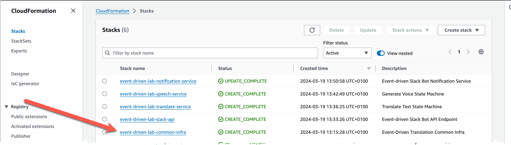
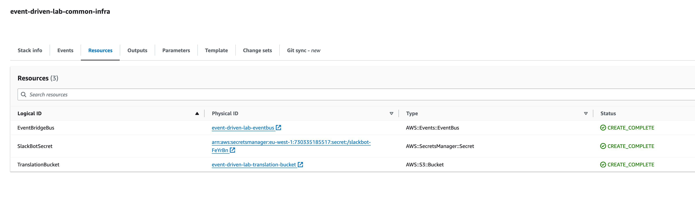
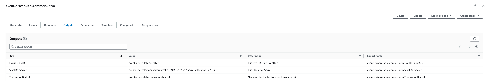
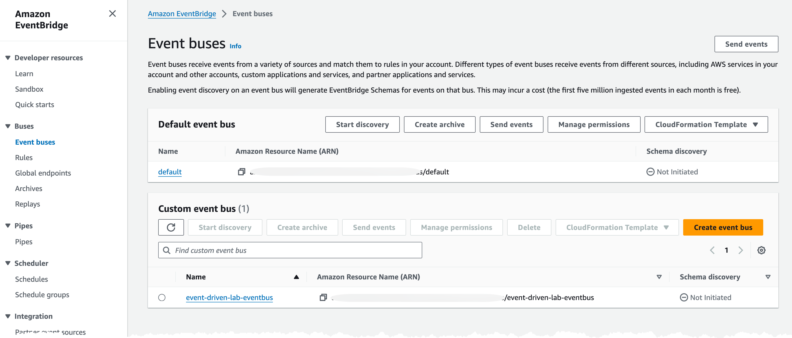
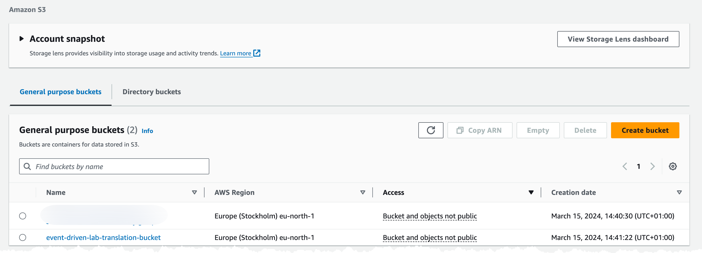
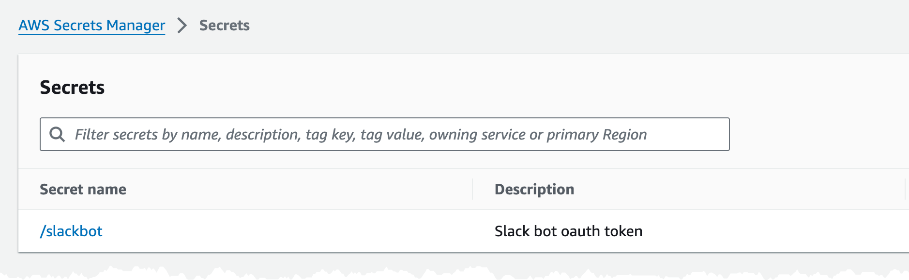

# Create common infrastructure

In this part you will create the common infrastructure that will be used by several parts of the lab.

## EventBridge Custom EventBus

It's a best practice to create an custom event-bus for your applications, the default event-bus should be left alone and only used by AWS services.

## S3 Bucket

Through out the lab an S3 bucket will be used to store temporary information.

## Secrets Manager Secret

A Secrets Manager Secret will be used to store the Slack Bot OAuth token.

## Create Resources

Inspect the [CloudFormation template](iac/template.yaml) to understand what is created.

Update the [Sam Config file](iac/samconfig.yaml) and add a value for BucketSuffix to ensure the name of the S3 Bucket is unique. The name will be: "event-driven-lab-translation-bucket-{BucketSuffix}"

Deploy the infrastructure, from the iac folder, with command:

``` bash

sam deploy --config-env default --profile YOUR-NAMED-PROFILE

```

## Inspect created resources

Resources was created with SAM and CloudFormation, what has been created can be found in the CloudFormation section.


Located the common stack that was just created, and click on it.


In the Resources tab, you can see what was created.


In the outputs tab you can see what has been exported as values from the stack, you will use this part later in the lab.


Navigate to EventBridge part of the AWS Console and ensure the event-bus has been created


Navigate to S3 part of the AWS Console and ensure the S3 bucket has been created


Navigate to SecretsManger part of the AWS Console and ensure the secret has been created

