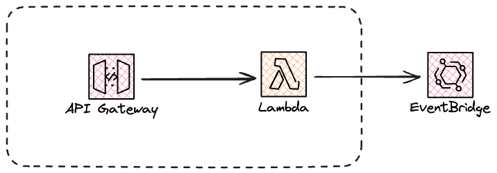
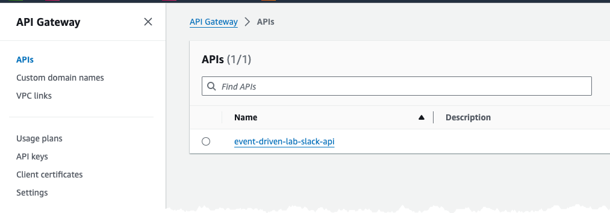
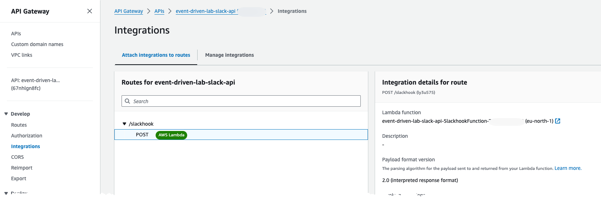
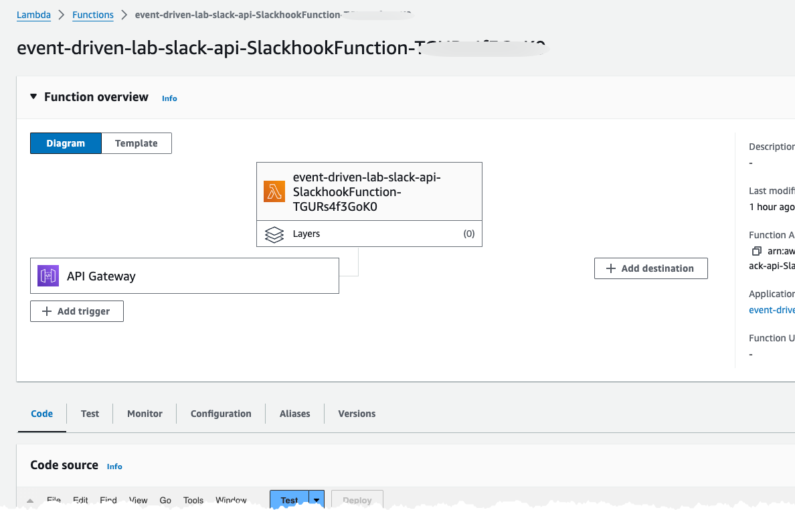

# Create Slack API

In this second part you will create API gateway that the Slack command will call.



## API Gateway

The API that are created will not have any form of Authentication attached, if you use this solution for anything but a lab make sure you add Authentication!

## Create Resources

Inspect the [CloudFormation template](iac/template.yaml) to understand what is created.

Inspect the [Source Code](iac/src/slackhook.py) to understand the logic and integration with EventBridge.

Inspect the command event that is sent, and notice the structure:

``` python
commandEvent = {
    "Languages": languageArray,
    "Text": translateText,
    "RequestId": event["requestContext"]["requestId"],
}
```

Deploy the infrastructure, from the iac folder, with command:

``` bash

sam deploy --config-env default --profile YOUR-NAMED-PROFILE

```

## Inspect created resources

Navigate to Api Gateway part of the AWS Console and ensure the API has been created


Navigate to integrations and check that the API is integrated with the Lambda function


Navigate to Lambda part of the AWS Console and inspect the created Lambda Function

