# Create Slack App

In this part you will create the Slack app and connect it to the previously created API.

## Create Slack Space

If you don't already have a Slack space you can use, create a temporary from [Slack.com](https://slack.com/get-started#/createnew)

## Create App

Now that you have the hook API up and running you can create the actual Slack App and slash command in Slack, navigate to [Slack API Apps](https://api.slack.com/apps/).
Click on Create New App to start creating a new Slack App.

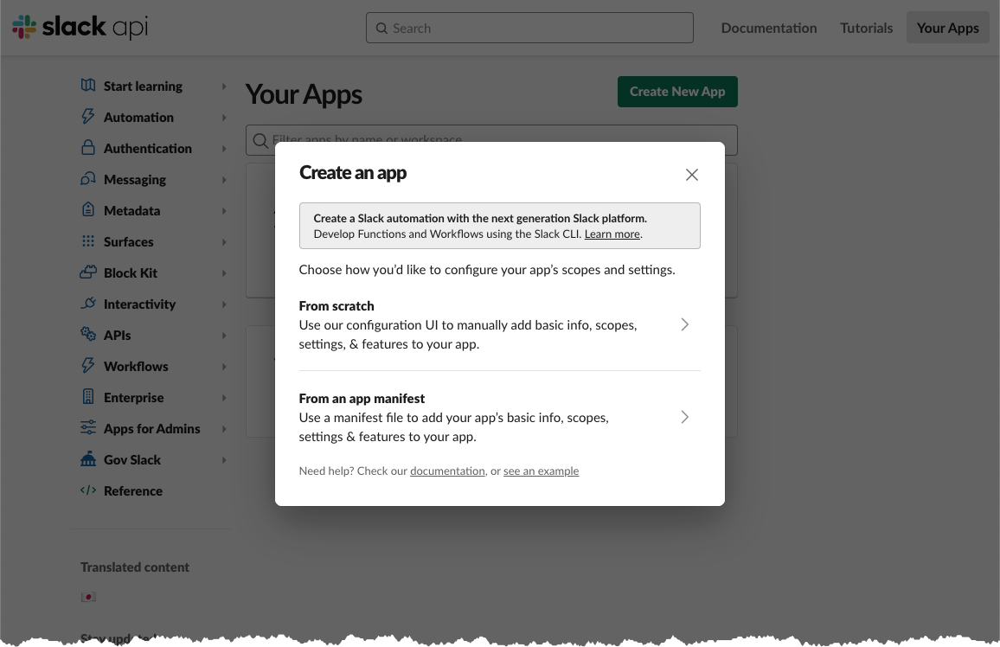

You can name the application anything, the instruction will use the name "Translation", don't forget to associate it with your workspace.

### Create Slash command

When you have created the app, created select it in the drop down menu and navigate to "Slash Commands"

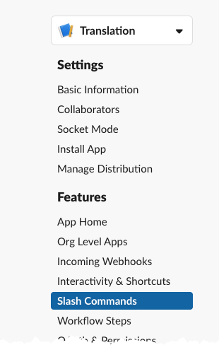

From here you create a new Slash Command.

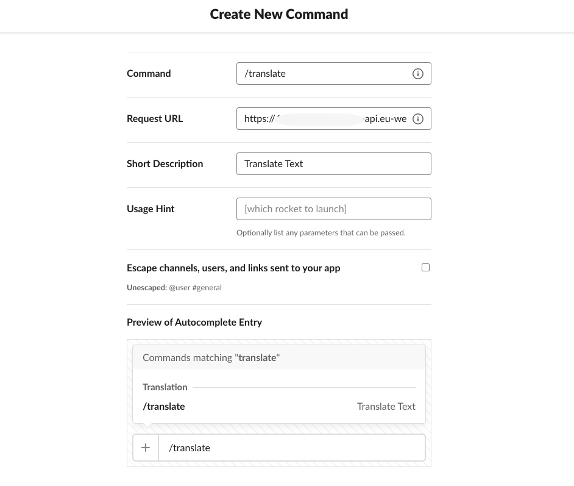

Create the "/translate" command, you need the url for the API that you created previously. The value is in the Output section of the Cloudformation template, copy the value for ApiEndpoint and paste it in Request URL box, don't forget to add the path, /slackhook to the copied value.

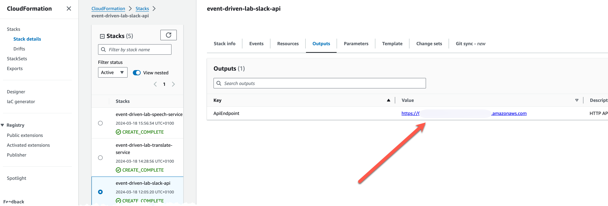

A short description of the command is not mandatory, but still enter a very basic description. After creation, the Slash Command should be visible in the menu.

### Configure permissions

Next you need to give our application some permissions, so it can post to your workspace. This is done from the OAuth and Permissions menu. The app need "chat:write", "commands", and "files:write", add these under the Scope section.

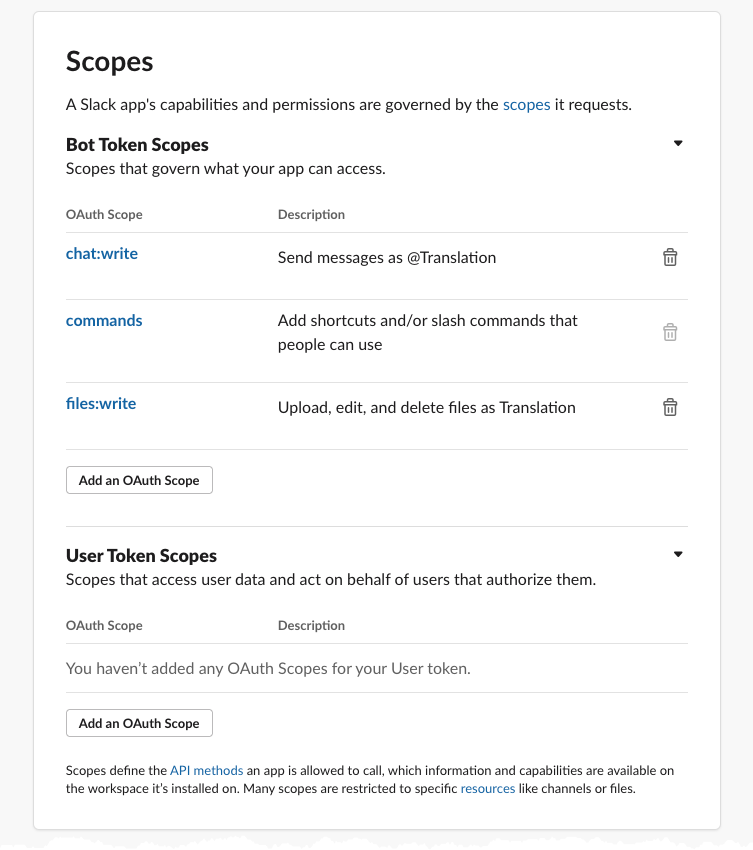

### Update Secrets Managers secret

You are almost there now. You need to add the OAuth token for the app to Secrets Manager and the secret created in the [common](../00-common-infra/) part.

To get the OAuth token you need yo first need to install the application to your workspace. Navigate to the top and click "Install to workspace".

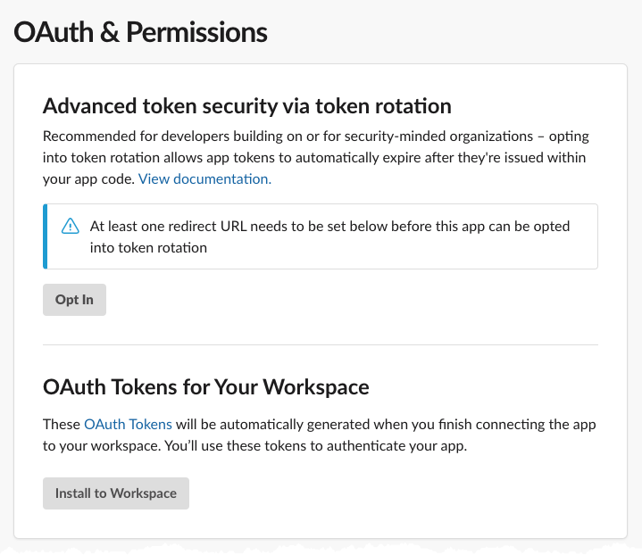

After a successful installation you should now have the OAuth token that you will need.

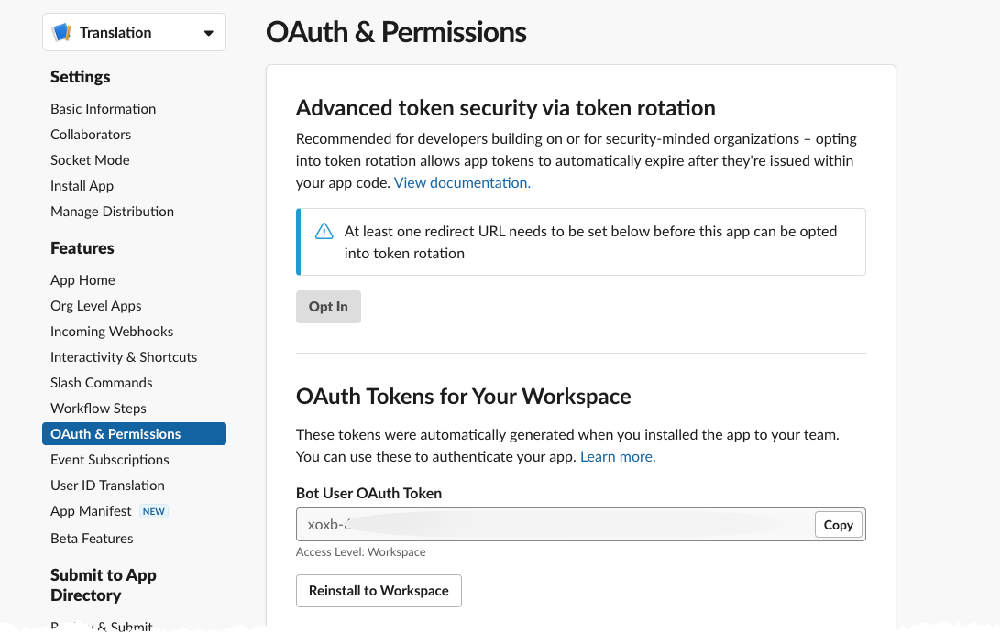

You need to copy this token and store it in the SecretsManager Secret, so head over to the AWS Console and SecretsManager.

Select the "/slackbot" secret and create a key/value pair with the key "OauthToken" and the value set to the token. Click the button "Retrieve secret value".

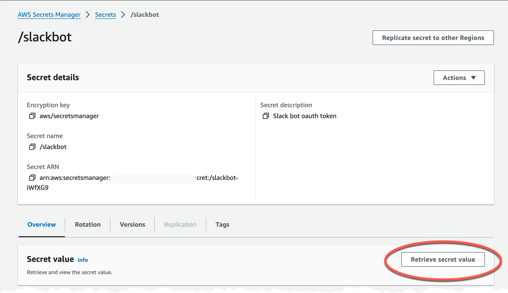

(First time you will see a "Set secret value" button), click that and add key-value pair

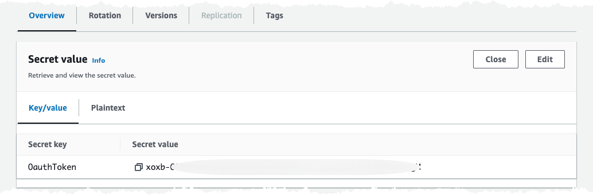

### Add app to channel

Final step. Navigate to your workspace, find the Translation app under Apps in the left pane, click it and select "Add this app to a channel" and select the channel of your choice.

In [notification part](../04-notification/) you will need the Slack channel ID. You get that by right clicking on the channel, select `Copy` and `Copy Link`. The ID is the last part of the link.

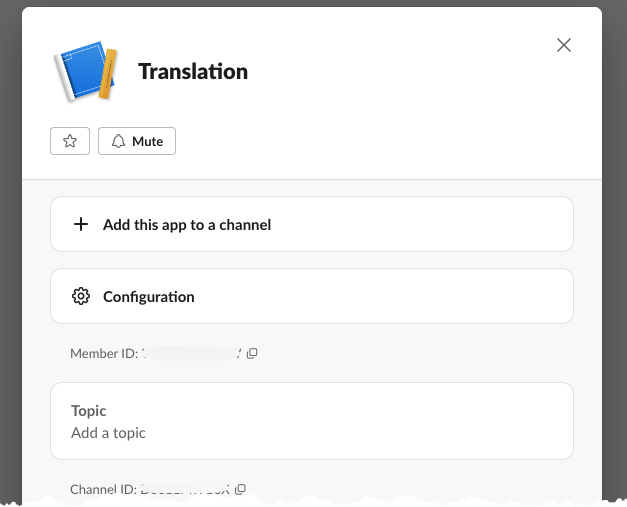

## Test

Test the setup by sending command /translate "Hello there, how are you", sv-SE

You should get a response back from the API

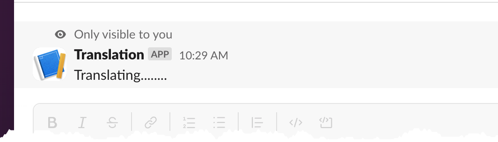
