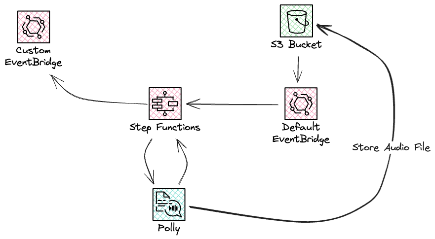
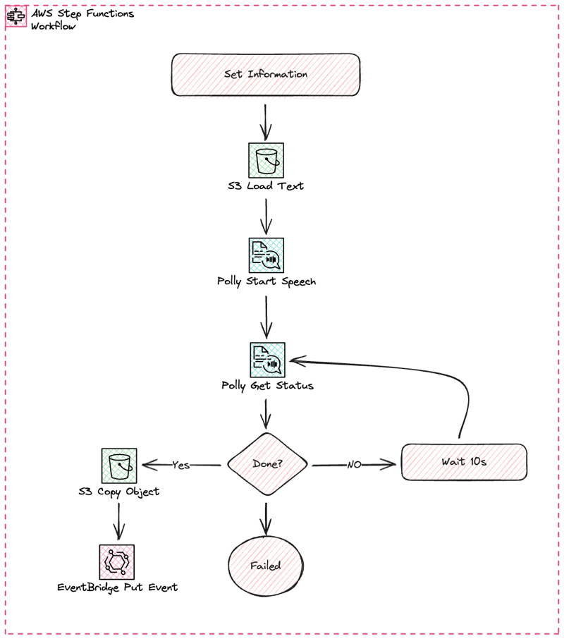
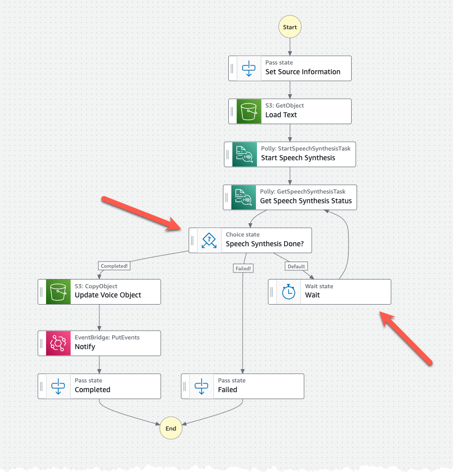

# Create Translation setup

Next part of the saga is the text to speech service, here we like to use Amazon Polly to read the translated text to us.



## StepFunction

This service will be invoked by the translated text being stored in the S3 bucket by the Translation service. This will invoke a StepFunction state-machine that will load the text and start a Polly speech synthesis task. The state-machine will poll and wait, using the wait state, for the task to finish, complete or fail.

The generated speech mp3 file will be copied to the same place as the translated text. Finally an event is posted onto a custom event-bus that will invoke the last part of our saga.

The StepFunction state-machine will look like this. The state-machine uses SDK and Optimized integrations making it possible to call AWS services directly without the need for a Lambda function.



## Create Resources

Inspect the [CloudFormation template](iac/template.yaml) to understand what is created.

Inspect the [StateMachine definition](iac/statemachine/) to understand the flow and logic, specially look at the Map task and understand the sub-flow.

Specially pay attention to the $ notation. Single $ will access the event data, and a double $$ will access the context object. [For Map state there are additional information available in the context object](https://docs.aws.amazon.com/step-functions/latest/dg/input-output-contextobject.html#contextobject-map)

Understand the Choice and Wait task and what they accomplish in this solution.

Deploy the infrastructure, from the iac folder, with command:

``` bash

sam deploy --config-env default --profile YOUR-NAMED-PROFILE

```

## Inspect created resources

Navigate to StepFunctions part of the AWS Console and ensure the state-machine has been created. Select it and press edit.

In the edit view, inspect each state by selecting it. Pay attention to the config to the right. Make sure you understand the Choice and Wait state.


