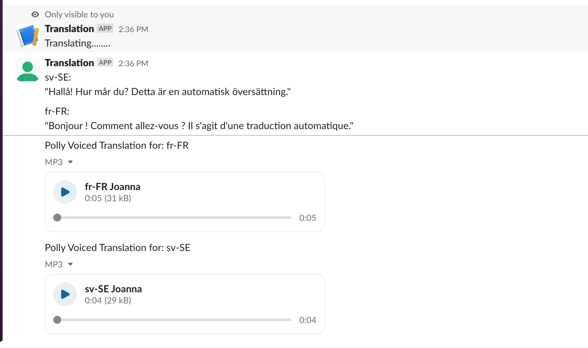
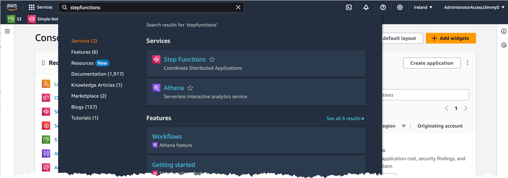
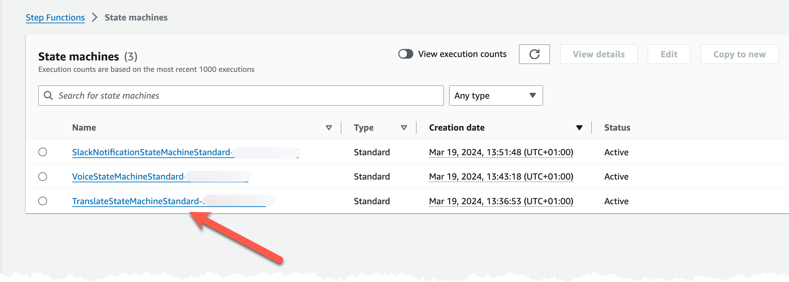
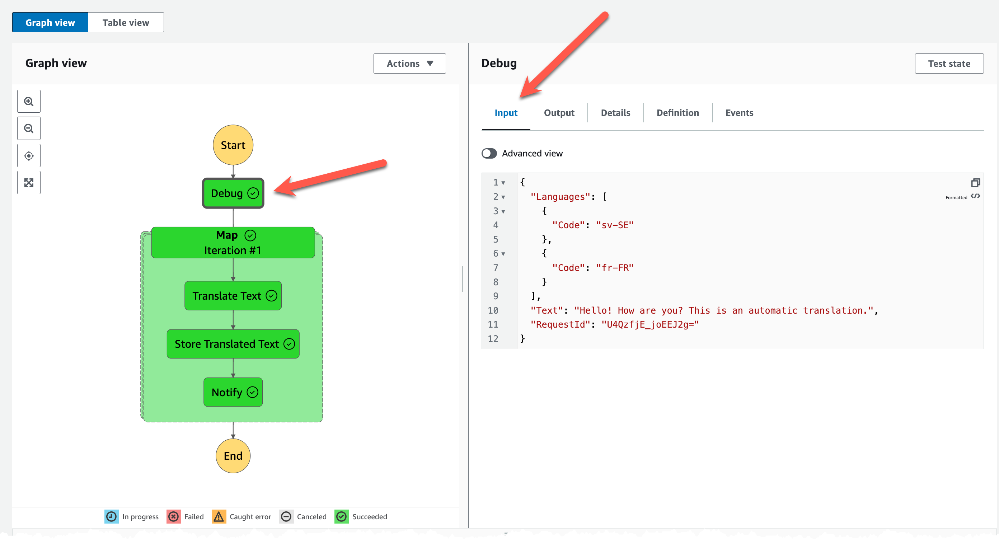

# Test the setup

In this section you will test the entire setup and learn more about the flow.

## Send command

From the Slack channel that you have created run this command to start a translation: '/translate "Hello! How are you? This is an automatic translation." sv-SE, fr-FR'
This should, if everything is correctly setup, create a translation back to the channel and the audio for it.

## Check StepFunction runs

Next, inspect each StepFunction and the invocation. Navigate to StepFunctions in the console.

Find the Translate StepFunction in the list and click it.

You will see a list of all invocations, click on the latest run.

Click each of the steps in the flow and look at the input and output data from the step.

Repeat for all of the StepFunctions to understand what they do, and what data was handled.

## Test additional command

What will happen if you send command '/translate "Hello! How are you?", sv-SE'?
Why do you think this happens?
