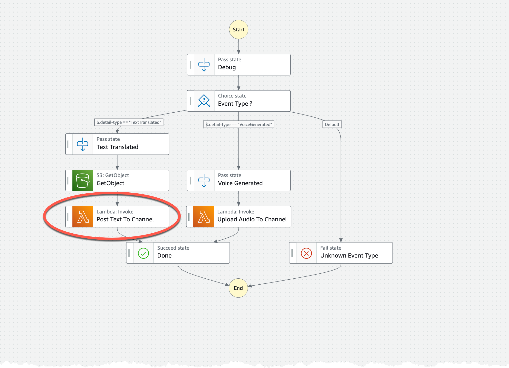

# Extra exercise

In this section you will try and modify the StepFunction that post messages back to slack.

How can the Lambda function that is used to post the text message to Slack be replaced by an SDK integration?

Your task is to replace this lambda function. Check the [HTTPS endpoints support](https://aws.amazon.com/about-aws/whats-new/2023/11/aws-step-functions-https-endpoints-teststate-api/)

## Hints

If you need more hints and help doing this replacement check the following resources:

My blog post:
[AWS StepFunctions HTTP Endpoint demystified](https://jimmydqv.com/stepfunctions-http-api/index.html)

My Serverless handbook:
[A Slack Channel Poster using StepFunctions HTTP EndPoint](http://serverless-handbook.com/slack-channel-poster)