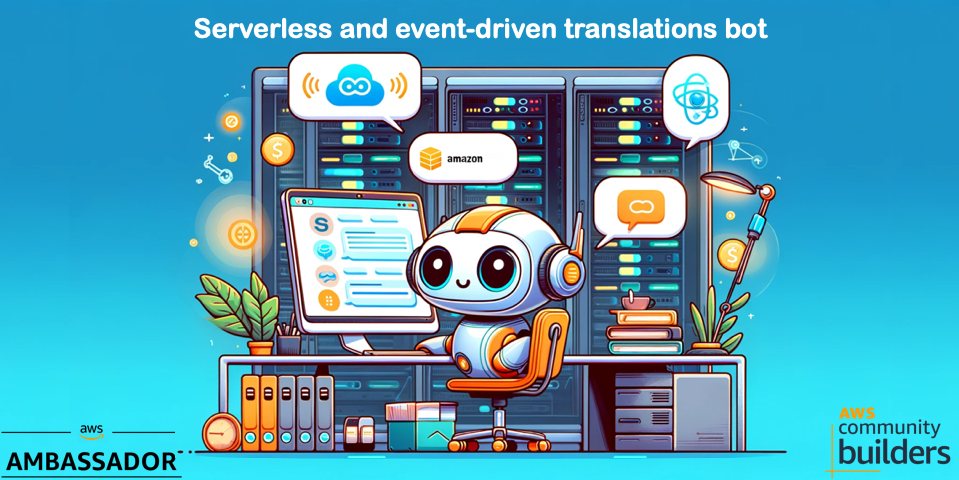
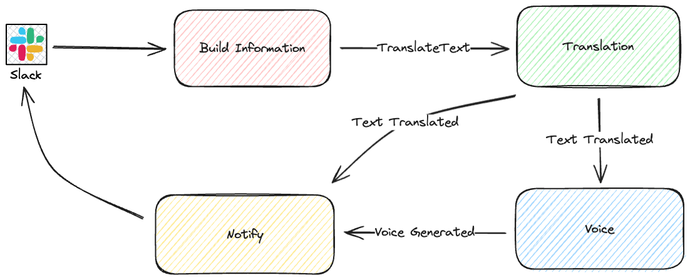
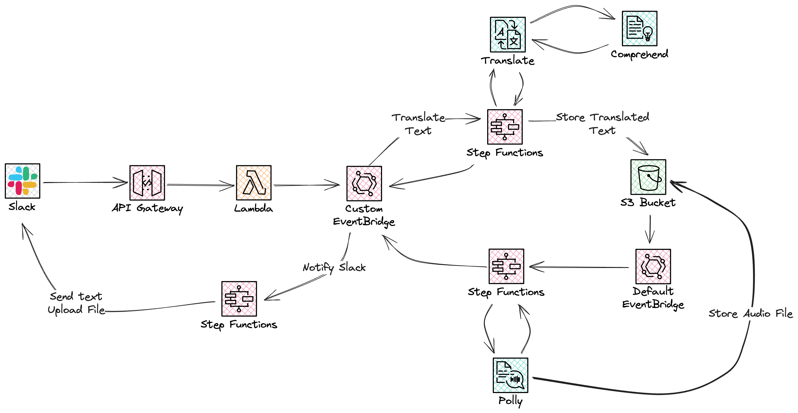

# Lab Serverless and event-driven AI translation Slack bot

In this lab you will create a serverless and event-driven translations service with Slack integration.

## Key learnings

* Serverless and event-driven service
* AWS AI Services, Translate and Polly
* Orchestration and choreography in a serverless service
* Saga pattern for an event-driven service

## Overview

In this solution we will combine the best of two worlds from orchestration and choreography. We have four domain services that each is responsible for a certain task. They will emit domain events so we can orchestrate a Saga pattern. Where services will be invoked in different phases and in response to domain events. Each of the service consists of several steps choreographed by StepFunctions to run in a certain order.

If we now add some more details to the image above, and start laying out the services we use. We have our hook that Slack will invoke on our slash command this is implemented with API Gateway and Lambda. The translation service that is implemented with a StepFunction and Amazon Translate. The text to voice service, which is also is setup with a StepFunction and Amazon Polly. The final service is a service responsible communicating back to Slack with both the translated text but also the generated voice file.

The services are invoked and communicate in an event-driven way over EventBridge event-buses, both a custom and the default bus. The default bus relay messages from S3 when objects are created.

With that short overview, let us dive deep into the different services, events, logic, and infrastructure.

This lab has several parts, where each part will move you closer to the full solution. In each part you will create a section of the solution using CloudFormation and [SAM](https://aws.amazon.com/serverless/sam/).

## Setup prerequisites

Before you start make sure:
* [SAM Cli](https://docs.aws.amazon.com/serverless-application-model/latest/developerguide/install-sam-cli.html) has been installed.
* AWS CLI is configured to use [Identity Center](https://docs.aws.amazon.com/cli/latest/userguide/sso-configure-profile-token.html) or
  * [IAM User](https://docs.aws.amazon.com/cli/latest/userguide/cli-authentication-user.html) (Not Recommended).

## Deep Dive

For more information or help, visit the [Introduction Blog Post](https://jimmydqv.com/eventdriven-translation-bot/index).

## Command structure

The command you send to Slack has the following structure, and this is important for testing purpose.
Start with the slash command, followed by text to translate in quotation, then each language code to translate to separated by comma.
Since you will be using Polly for text to speech, you must use [language codes supported by Polly](https://docs.aws.amazon.com/polly/latest/dg/SupportedLanguage.html)

### Example

/[your-slash-command] "[text to translate]" [language-code], [language-code], .....

/translate "Hello there, how are you" sv-SE, da-DK
